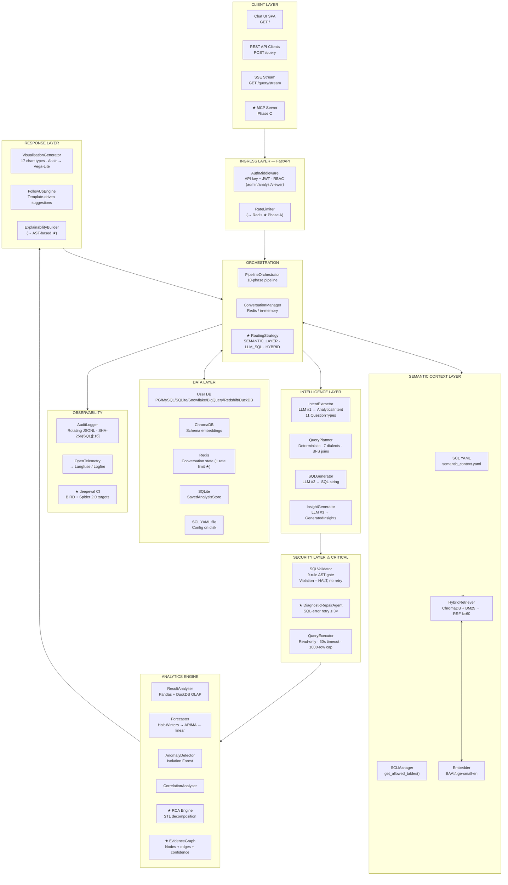
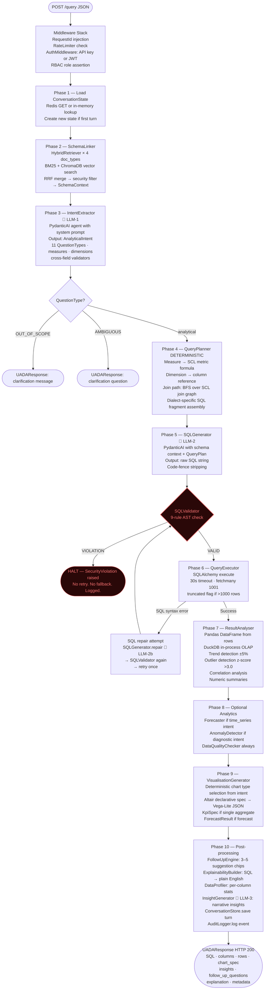
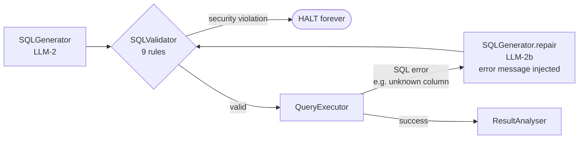
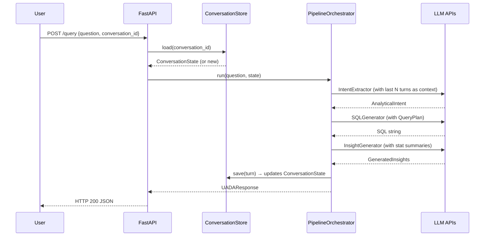
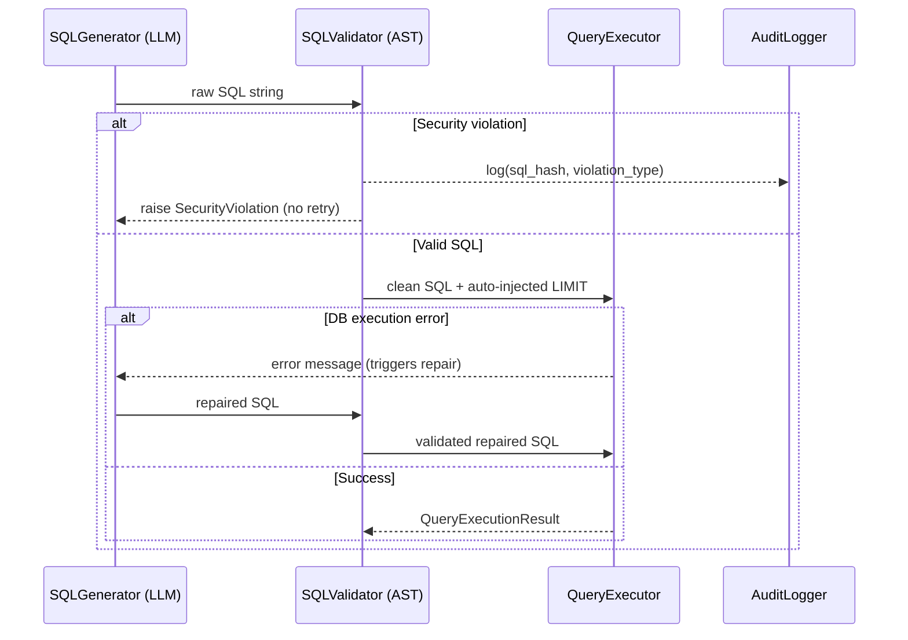
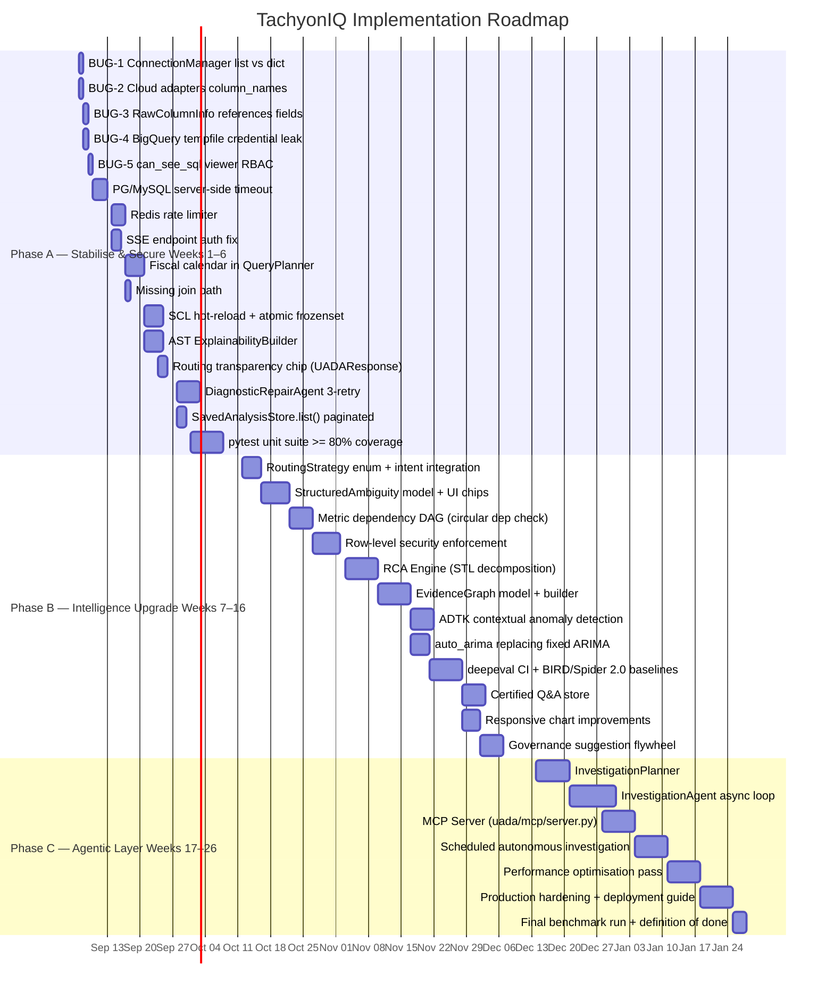

# TachyonIQ / UADA — Architecture & Documentation

> **Single source of truth.** This file describes the complete system: every component, every data flow, every decision, every gap.
> Status markers: **IMPLEMENTED** = production-ready; **PARTIAL** = working but incomplete; **PROPOSED** = designed, not yet built.

---

## Table of Contents

1. [Project Overview](#1-project-overview)
2. [Technology Stack](#2-technology-stack)
3. [Repository Structure](#3-repository-structure)
4. [System Architecture — Layer View](#4-system-architecture--layer-view)
5. [Complete Query Pipeline](#5-complete-query-pipeline)
   - [5.0 Ingress & Middleware](#50-ingress--middleware)
   - [5.1 Load Conversation State](#51-phase-1--load-conversation-state)
   - [5.2 Schema Linking](#52-phase-2--schema-linking)
   - [5.3 Intent Extraction — LLM Call #1](#53-phase-3--intent-extraction--llm-call-1)
   - [5.4 Query Planning](#54-phase-4--query-planning-deterministic)
   - [5.5 SQL Generation — LLM Call #2](#55-phase-5--sql-generation--llm-call-2)
   - [5.6 Security Gate — SQLValidator ⚠](#56-security-gate--sqlvalidator-)
   - [5.7 Query Execution](#57-phase-6--query-execution)
   - [5.8 Result Analysis](#58-phase-7--result-analysis)
   - [5.9 Optional Analytics](#59-phase-8--optional-analytics)
   - [5.10 Visualization](#510-phase-9--visualization)
   - [5.11 Post-processing & Insight — LLM Call #3](#511-phase-10--post-processing--insight--llm-call-3)
6. [AI / Agent Pipeline — Deep Dive](#6-ai--agent-pipeline--deep-dive)
7. [Semantic Context Layer (SCL)](#7-semantic-context-layer-scl)
8. [Security Architecture](#8-security-architecture)
9. [Analytics Engine](#9-analytics-engine)
10. [Visualization Layer](#10-visualization-layer)
11. [Data Layer](#11-data-layer)
12. [API Reference](#12-api-reference)
13. [Configuration](#13-configuration)
14. [Observability](#14-observability)
15. [Error Handling & Self-Correction](#15-error-handling--self-correction)
16. [Data Flows — Mermaid Diagrams](#16-data-flows--mermaid-diagrams)
17. [Known Bugs](#17-known-bugs)
18. [Design Gaps](#18-design-gaps)
19. [Proposed Architecture](#19-proposed-architecture)
20. [Proposed Model Extensions](#20-proposed-model-extensions)
21. [Competitive Context](#21-competitive-context)
22. [Evaluation Strategy](#22-evaluation-strategy)
23. [Definition of Done](#23-definition-of-done)
24. [Implementation Roadmap](#24-implementation-roadmap)

---

## 1. Project Overview

**TachyonIQ** (internal codename: **UADA — Universal Analytics Data Agent**) is a conversational analytics platform that lets business users ask natural-language questions about their databases and receive structured answers — SQL query, result table, chart, statistical insight, and narrative explanation — without writing SQL.

### Why it exists

Traditional BI tools require analysts to write queries. LLM-only text-to-SQL is unreliable on real enterprise databases (10–17% accuracy on Spider 2.0 benchmarks). TachyonIQ combines:

- A **Semantic Context Layer (SCL)** that encodes business meaning (metrics, joins, glossary) to ground the LLM
- **Deterministic SQL planning** from SCL-defined metrics for governed queries
- **AST-based SQL security validation** that cannot be bypassed regardless of LLM output
- **Layered analytics** (trend, anomaly, forecast, correlation) on top of raw query results
- **Multi-turn conversation** with full context tracking

### Design Philosophy

1. **LLM output is untrusted.** Every SQL string generated by the LLM passes through a deterministic AST validator before execution. The LLM never directly executes SQL.
2. **Semantic layer is the accuracy moat.** Named metrics with explicit formulas outperform raw LLM text-to-SQL by 10–15 percentage points on in-scope queries.
3. **Security violations halt immediately.** There is no retry on a security violation — ever. This prevents adversarial prompt injection from forcing alternate SQL paths.
4. **Analytics should explain, not just return rows.** The platform computes trend direction, outliers, forecasts, and anomalies on every result set automatically.

---

## 2. Technology Stack

| Layer | Technology | Why |
|---|---|---|
| API framework | FastAPI (Python) | Native async, SSE support, OpenAPI generation |
| LLM orchestration | PydanticAI | Structured outputs with Pydantic models; `defer_model_check=True` for clean testing |
| SQL security | SQLGlot | AST-level SQL parsing across 7 dialects; no regex heuristics |
| Schema retrieval | ChromaDB + rank-bm25 | Vector + lexical hybrid; RRF merge for precision |
| Embeddings | SentenceTransformer `BAAI/bge-small-en` | Fast, local, no external API dependency |
| Data analysis | Pandas + DuckDB | Pandas for data manipulation; DuckDB for in-process OLAP queries |
| Forecasting | statsmodels (Holt-Winters, ARIMA) | Proven time-series; cascading fallback by data size |
| Anomaly detection | scikit-learn (Isolation Forest) | Unsupervised; works without labeled data |
| Visualization | Altair → Vega-Lite JSON | Declarative; frontend-agnostic JSON spec |
| DB connectivity | SQLAlchemy 2.x | Unified ORM for 7 dialects |
| Config | pydantic-settings | Type-safe env vars; `.env` support |
| Conversation state | Redis / in-memory | Redis in production; in-memory for local dev |
| Vector store | ChromaDB | Embedded; no external service needed for dev |
| Observability | OpenTelemetry → Langfuse / Logfire | Vendor-agnostic traces |
| Audit | Rotating JSONL | Append-only, no DB dependency |

### Supported Database Dialects (IMPLEMENTED)

PostgreSQL · MySQL · SQLite · Microsoft SQL Server · Snowflake† · BigQuery† · Redshift†

> `†` Cloud adapters have confirmed bugs (see [§17](#17-known-bugs)) — fix before production use.

---

## 3. Repository Structure

```
UADA/
├── config/
│   └── semantic_context.yaml          # SCL definition (tables, metrics, joins, glossary)
├── uada/
│   ├── config.py                      # Settings — all UADA_* env vars
│   ├── models/
│   │   ├── intent.py                  # AnalyticalIntent, QuestionType (11 values)
│   │   ├── result.py                  # UADAResponse, AnalysedResult, VegaLiteSpec, KpiSpec, ForecastResult
│   │   ├── conversation.py            # ConversationState, ConversationTurn, ActiveContext
│   │   ├── query_plan.py              # QueryPlan, ResolvedMeasure, ResolvedJoin
│   │   └── schema_context.py          # SchemaContext, TableContext, ColumnContext (field: column_name)
│   ├── scl/
│   │   ├── schema.py                  # SemanticContextLayer, SecurityPolicy Pydantic models
│   │   ├── loader.py                  # SCLLoader, _SCLSafeLoader — YAML 1.2 safe parse
│   │   ├── manager.py                 # SCLManager — lookup indexes, get_allowed_tables()
│   │   └── reflector.py               # SCLReflector — build SCL from live DB introspection
│   ├── pipeline/
│   │   ├── orchestrator.py            # PipelineOrchestrator — drives all 10 phases
│   │   ├── schema_linker.py           # SchemaLinker — HybridRetriever → SchemaContext
│   │   ├── intent_extractor.py        # IntentExtractor — PydanticAI agent → AnalyticalIntent
│   │   ├── query_planner.py           # QueryPlanner — deterministic; 7 dialects; BFS joins
│   │   ├── sql_generator.py           # SQLGenerator — PydanticAI → SQL string
│   │   ├── sql_validator.py           # SQLValidator — 9-rule AST gate (CRITICAL)
│   │   ├── result_analyser.py         # ResultAnalyser — Pandas + DuckDB OLAP
│   │   ├── viz_generator.py           # VisualisationGenerator — 17 chart types
│   │   ├── followup_engine.py         # FollowUpEngine — template-driven suggestions
│   │   ├── insight_generator.py       # InsightGenerator — LLM #3 from stat summaries
│   │   ├── conversation_store.py      # ConversationStore — Redis or in-memory
│   │   └── data_profiler.py           # DataProfiler — per-column stats, no PII in LLM
│   ├── analytics/
│   │   ├── anomaly.py                 # AnomalyDetector — Isolation Forest
│   │   ├── correlation.py             # CorrelationAnalyser — Pearson/Spearman
│   │   ├── data_quality.py            # DataQualityChecker — nulls, dups, type consistency
│   │   ├── explainability.py          # ExplainabilityBuilder — SQL → plain English (regex, FRAGILE)
│   │   └── forecast.py                # Forecaster — Holt-Winters → ARIMA → linear fallback
│   ├── retrieval/
│   │   ├── hybrid.py                  # HybridRetriever — RRF merge of Chroma + BM25 (k=60)
│   │   └── embedder.py                # Embedder — SentenceTransformer BAAI/bge-small-en
│   ├── db/
│   │   ├── adapter.py                 # SQLAlchemyAdapter — PG/MySQL/SQLite/MSSQL + timeout
│   │   ├── connection_manager.py      # DatabaseConnectionManager — UUID registry (BUG-1)
│   │   ├── interface.py               # QueryExecutionResult(column_names, rows) dataclass
│   │   └── adapters/
│   │       ├── snowflake.py           # SnowflakeAdapter (BUG-2)
│   │       ├── bigquery.py            # BigQueryAdapter (BUG-2, BUG-4)
│   │       └── redshift.py            # RedshiftAdapter (BUG-2)
│   ├── observability/
│   │   ├── audit.py                   # AuditLogger — rotating JSONL, SHA-256(SQL)[:16]
│   │   └── tracer.py                  # configure_tracing() — OpenTelemetry → Langfuse/logfire
│   ├── api/
│   │   ├── app.py                     # create_app() — FastAPI lifespan, middleware stack
│   │   ├── middleware/
│   │   │   └── auth.py                # AuthMiddleware — API key + JWT RBAC, 3 roles
│   │   └── routes/
│   │       ├── query.py               # POST /query, GET /query/stream
│   │       ├── connections.py         # CRUD + test/discover/refresh (BUG-1 path)
│   │       └── ui.py                  # Self-contained HTML SPA at GET /
│   └── db/
│       └── saved_analysis_store.py    # Thread-safe SQLite CRUD for saved analyses
├── scripts/
│   └── onboard_db.py                  # SCLReflector runner — generates SCL YAML from DB schema
├── tests/                             # (sparse — no unit test suite yet)
├── pyproject.toml                     # Project config; dev deps include deepeval
└── .env.example                       # Environment variable reference
```

---

## 4. System Architecture — Layer View



> ★ = PROPOSED (not yet implemented). All other nodes = IMPLEMENTED.

---

## 5. Complete Query Pipeline

A single `POST /query` request traverses the following stages in order. All stages run synchronously within FastAPI's async event loop. **Three LLM calls total** per non-trivial query.

### Full flow (Mermaid)



---

### 5.0 Ingress & Middleware

**Status:** IMPLEMENTED (partial gaps in RBAC enforcement — see [§18](#18-design-gaps))

**File:** `uada/api/app.py`, `uada/api/middleware/auth.py`

#### What it does

Every request passes through a middleware stack before reaching the route handler:

1. **Request ID injection** — `X-Request-ID` header set for all requests; used in logs.
2. **Rate limiter** — per-IP sliding window. Currently implemented in-process using a dict; this means rate limits are per-worker and not shared across multiple uvicorn processes. In production with multiple workers, a request can exceed the nominal limit by a factor equal to the worker count.
3. **AuthMiddleware** — validates either:
   - **API key**: `Authorization: Bearer <key>` matched against `UADA_API_KEYS` env var list
   - **JWT**: `Authorization: Bearer <jwt>` validated against `UADA_JWT_SECRET`
4. **RBAC** — three roles extracted from the JWT `role` claim or API key metadata:
   - `admin` — full access including connection management
   - `analyst` — full query access, sees raw SQL in response
   - `viewer` — query access only; **gap: currently sees SQL too** (see BUG-5)

#### Why this approach

FastAPI middleware runs before routing, ensuring auth cannot be bypassed by a route handler bug. API key + JWT dual support allows both service-to-service (API key) and user-session (JWT) authentication patterns without changing the query interface.

---

### 5.1 Phase 1 — Load Conversation State

**Status:** IMPLEMENTED

**File:** `uada/pipeline/conversation_store.py`, `uada/models/conversation.py`

#### What it does

Loads the `ConversationState` for the current `conversation_id` from Redis (or in-memory dict in dev). If no state exists, creates a new one.

#### Key models

```python
# uada/models/conversation.py

class ConversationTurn(BaseModel):
    turn_id: str                    # UUID
    user_question: str
    generated_sql: str | None
    result_summary: str | None
    intent: AnalyticalIntent | None
    timestamp: datetime

class ActiveContext(BaseModel):
    active_tables: list[str]        # Tables referenced in last 3 turns
    active_measures: list[str]
    active_filters: dict[str, Any]  # Carry-forward WHERE conditions

class ConversationState(BaseModel):
    conversation_id: str
    turns: list[ConversationTurn]
    active_context: ActiveContext
    created_at: datetime
    last_activity: datetime
```

#### Why conversation state matters

Multi-turn analytics requires context carry-forward. "Break that down by region" is meaningless without the previous turn's metric and time filter. The `ActiveContext` model tracks which tables, measures, and filters are in play so the IntentExtractor can resolve pronouns and implicit references.

**Turn compression:** When `len(turns) > UADA_MAX_TURNS` (default 20), older turns are compressed to a summary string using the `compress_turn()` method, preventing unbounded Redis growth.

---

### 5.2 Phase 2 — Schema Linking

**Status:** IMPLEMENTED

**File:** `uada/pipeline/schema_linker.py`, `uada/retrieval/hybrid.py`, `uada/retrieval/embedder.py`

#### What it does

Converts the user's free-text question into a `SchemaContext` — a structured snapshot of the tables, columns, metrics, and glossary terms most relevant to the question. This context is injected into the LLM prompt in Phase 3.

#### How it works

The `SchemaLinker` calls `HybridRetriever.retrieve()` **four times** — once per document type stored in ChromaDB:

| doc_type | Content embedded | Purpose |
|---|---|---|
| `table` | Table name + description + grain | Find relevant tables |
| `column` | Column name + description + semantic_type | Find relevant columns |
| `metric` | Metric name + description + formula + aliases | Find SCL-defined metrics |
| `glossary` | Term + description + sql_filter | Find business term translations |

For each doc_type, `HybridRetriever` runs two searches:
- **BM25 lexical search** using `rank-bm25` — fast, exact-match friendly, handles abbreviations
- **ChromaDB vector search** using `BAAI/bge-small-en` embeddings — handles synonyms and paraphrases

Results are merged via **Reciprocal Rank Fusion (RRF)** with `k=60`:

```python
# Simplified RRF merge
score = sum(1 / (k + rank_i) for rank_i in [bm25_rank, vector_rank] if rank_i is not None)
```

**Security filter:** After retrieval, `SchemaLinker` filters out any table or column marked `excluded: true` in the SCL or listed in `security_policy.excluded_tables`. The `SchemaContext` passed to the LLM **never contains excluded schema elements**. This is the first layer of the security fence.

#### Output: SchemaContext

```python
# uada/models/schema_context.py

class ColumnContext(BaseModel):
    column_name: str          # NOTE: field is column_name, not name
    description: str
    semantic_type: str        # measure | dimension | temporal | identifier | text
    is_temporal: bool
    is_primary_key: bool
    is_foreign_key: bool
    aggregation: str | None   # SUM | AVG | COUNT etc.
    enum_values: list[str]

class TableContext(BaseModel):
    table_name: str
    description: str
    grain: str
    columns: list[ColumnContext]

class SchemaContext(BaseModel):
    tables: list[TableContext]
    relevant_metrics: list[dict]  # From SCL metrics index
    relevant_glossary: list[dict] # From SCL glossary index
    join_paths: list[dict]        # Applicable joins from SCL
```

---

### 5.3 Phase 3 — Intent Extraction — LLM Call #1

**Status:** IMPLEMENTED

**File:** `uada/pipeline/intent_extractor.py`, `uada/models/intent.py`

#### What it does

Sends the user's question, conversation history (last N turns), and `SchemaContext` to an LLM via a PydanticAI agent. The LLM outputs a structured `AnalyticalIntent` Pydantic model.

#### Why PydanticAI

PydanticAI enforces that the LLM response is a valid instance of `AnalyticalIntent`. If the LLM produces malformed JSON or a field fails a Pydantic validator, PydanticAI retries with the validation error in context. `defer_model_check=True` allows the agent to be instantiated without a live model connection (enables unit testing).

#### AnalyticalIntent model

```python
# uada/models/intent.py

class QuestionType(str, Enum):
    AGGREGATION      = "aggregation"       # "What was total revenue?"
    TIME_SERIES      = "time_series"       # "Show monthly revenue for 12 months"
    RANKING          = "ranking"           # "Top 10 customers by revenue"
    COMPARISON       = "comparison"        # "Revenue this year vs last year"
    DIAGNOSTIC       = "diagnostic"        # "Why did revenue drop in March?"
    FOLLOW_UP_REFINE = "follow_up_refine"  # "Filter to Enterprise only"
    FOLLOW_UP_EXTEND = "follow_up_extend"  # "Now break by region"
    FOLLOW_UP_EXPLAIN= "follow_up_explain" # "What does that spike mean?"
    OUT_OF_SCOPE     = "out_of_scope"      # Non-analytics question
    AMBIGUOUS        = "ambiguous"         # Cannot resolve without clarification
    UNKNOWN          = "unknown"           # Fallback

class AnalyticalIntent(BaseModel):
    question_type:    QuestionType
    measures:         list[str]           # e.g. ["revenue", "order_count"]
    dimensions:       list[str]           # e.g. ["region", "customer.segment"]
    filters:          dict[str, Any]      # e.g. {"status": "delivered"}
    time_range:       dict[str, str] | None  # {"start": "...", "end": "..."}
    time_granularity: str | None          # "day" | "week" | "month" | "quarter" | "year"
    sort_by:          str | None
    sort_direction:   str | None          # "asc" | "desc"
    limit:            int | None
    original_question: str

    # Cross-field validators enforce:
    # - TIME_SERIES must have time_granularity
    # - RANKING must have sort_by and limit
    # - FOLLOW_UP_* must reference a prior turn's measures
```

#### System prompt design

The system prompt includes:
1. The full `SchemaContext` (tables, columns, metrics, glossary) in structured YAML-like format
2. The last N conversation turns (compressed if long)
3. Few-shot examples from the SCL `examples` section (retrieved by similarity)
4. Explicit instructions to output `OUT_OF_SCOPE` rather than hallucinate schema elements

#### Why 11 QuestionTypes

Each type maps to a different downstream path. `AGGREGATION` produces a single aggregate SQL; `TIME_SERIES` requires a `GROUP BY time_bucket(...)` pattern; `RANKING` requires `ORDER BY ... LIMIT`; `DIAGNOSTIC` triggers the anomaly/correlation analytics; `FOLLOW_UP_*` types carry forward context from `ActiveContext`. Having explicit types prevents the QueryPlanner from generating structurally incorrect SQL.

---

### 5.4 Phase 4 — Query Planning (Deterministic)

**Status:** IMPLEMENTED (fiscal calendar: PARTIAL)

**File:** `uada/pipeline/query_planner.py`, `uada/models/query_plan.py`

#### What it does

Translates `AnalyticalIntent` into a `QueryPlan` — a structured intermediate representation that the SQLGenerator (LLM #2) uses as its primary input. The QueryPlanner is **fully deterministic**: no LLM, no randomness.

#### Why a separate planning step

Without a planning step, SQLGenerator would receive a raw natural-language question and hope to produce correct SQL. With `QueryPlan`, SQLGenerator receives a structured document specifying exactly which tables, joins, measures (with their SCL formulas), dimensions, filters, and time bucketing are needed. This dramatically reduces LLM hallucination of wrong table names, non-existent columns, or incorrect aggregations.

#### How it works

```
AnalyticalIntent
  ↓ measure resolution
    For each measure name in intent.measures:
      1. Check SCL metrics index by name and aliases
      2. If found → ResolvedMeasure with formula, filters, grain
      3. If not found → raw column reference
  ↓ dimension resolution
    For each dimension name in intent.dimensions:
      1. Check SchemaContext columns by column_name
      2. Resolve to table.column reference
  ↓ join path resolution (BFS)
    Given the set of required tables:
      1. Build adjacency graph from SCL joins
      2. BFS from the primary table (grain = intent grain)
      3. Emit ResolvedJoin list (from_table, to_table, on, join_type)
  ↓ time range building
    If intent.time_range is set:
      1. Parse start/end dates
      2. Generate dialect-specific date truncation expression
      3. Build WHERE clause fragment for time filter
      4. FISCAL YEAR: if fiscal_year_start_month != 1:
         → logs WARNING "fiscal_year_start_month not yet implemented" and skips filter
  ↓ emit QueryPlan
```

#### QueryPlan model

```python
# uada/models/query_plan.py

class ResolvedMeasure(BaseModel):
    name: str
    formula: str              # e.g. "SUM(orders.revenue)"
    scl_filters: str | None   # e.g. "orders.status != 'cancelled'"

class ResolvedJoin(BaseModel):
    from_table: str
    to_table: str
    on: str
    join_type: str            # LEFT | INNER | RIGHT

class QueryPlan(BaseModel):
    primary_table: str
    measures: list[ResolvedMeasure]
    dimensions: list[str]     # table.column references
    joins: list[ResolvedJoin]
    where_clauses: list[str]  # Raw SQL fragments
    time_column: str | None
    time_bucket: str | None   # "DATE_TRUNC('month', ...)"
    order_by: str | None
    limit: int | None
    dialect: str              # postgresql | mysql | sqlite | tsql | snowflake | bigquery | redshift
```

#### Dialect handling

The QueryPlanner emits dialect-specific fragments for:
- Date truncation: `DATE_TRUNC` (PG/Redshift/Snowflake) vs `DATE_FORMAT` (MySQL) vs `strftime` (SQLite) vs `DATETRUNC` (BigQuery/MSSQL)
- String quoting: backtick (MySQL/BigQuery) vs double-quote (PG/Snowflake) vs bracket (MSSQL)
- Top-N: `LIMIT` (most) vs `TOP` (MSSQL) vs `QUALIFY ROW_NUMBER()` (some Snowflake patterns)

#### Missing joins — current behaviour

If the QueryPlanner cannot find a BFS path connecting two required tables via SCL joins, it **silently skips** the join and logs a warning. The resulting SQL will have a missing join, which typically produces a Cartesian product or a SQL syntax error caught downstream by the repair loop. **This should raise an explicit error instead** (design gap).

---

### 5.5 Phase 5 — SQL Generation — LLM Call #2

**Status:** IMPLEMENTED

**File:** `uada/pipeline/sql_generator.py`

#### What it does

Sends the `QueryPlan` plus `SchemaContext` to an LLM via a PydanticAI agent. The LLM's job is to render valid SQL from the structured plan — it is **not** responsible for understanding the question or choosing the right tables (the planner already did that).

#### Input to LLM

```
System prompt:
  You are a SQL expert for {dialect}.
  The QueryPlan specifies exactly what to query. Your job is to write correct SQL
  that implements this plan. Do not add tables, columns, or filters not in the plan.
  Output only SQL. No explanation. No markdown fences.

User message:
  QueryPlan: {json(query_plan)}
  Schema context: {json(schema_context)}
  Original question: {intent.original_question}
```

#### Output processing

The LLM output is a raw string. `SQLGenerator` applies:
1. **Code-fence stripping** — removes ` ```sql ... ``` ` or ` ``` ... ``` ` wrappers
2. **Whitespace normalisation** — collapses excess newlines
3. Passes the clean SQL string to the SQLValidator

#### Why LLM for SQL generation

Even with a fully specified `QueryPlan`, writing syntactically valid SQL for complex joins, nested aggregates, window functions, and dialect-specific date arithmetic requires the LLM's language modelling. The planner handles what to query; the LLM handles how to express it in the target dialect.

---

### 5.6 Security Gate — SQLValidator ⚠

> **CRITICAL INVARIANT: `SQLValidator.validate()` runs inside the SQL repair loop before EVERY execution attempt. Security violations cause an immediate halt with no retry. This call must NEVER be moved outside the repair loop.**

**Status:** IMPLEMENTED

**File:** `uada/pipeline/sql_validator.py`

#### What it does

Parses the SQL string using SQLGlot (AST level, not regex) and applies 9 deterministic rules. A violation on any rule raises `SecurityViolation` immediately — no retry, no LLM re-generation, no fallback path.

#### Why AST-based

Regex-based SQL validation is trivially defeated by formatting tricks (e.g., `SE/*comment*/LECT`, newlines in identifiers, Unicode lookalikes). SQLGlot produces a dialect-agnostic AST that is immune to these tricks.

#### The 9 rules

| # | Rule | What triggers it | Violation type | Retry? |
|---|---|---|---|---|
| 1 | Empty input | Empty or whitespace-only string | `EMPTY_QUERY` | No |
| 2 | Comment injection | `--` or `/*` substring detected pre-parse | `COMMENT_INJECTION` | No |
| 3 | Multiple statements | AST has more than one statement node | `MULTIPLE_STATEMENTS` | No |
| 4 | Non-SELECT statement | AST root type is not a SELECT; blocks: INSERT, UPDATE, DELETE, DROP, CREATE, ALTER, MERGE, TRUNCATE, COMMAND, TRANSACTION, GRANT, REVOKE | `NON_SELECT_STATEMENT` | No |
| 5 | System schema access | Any table reference has a prefix matching 16 blocked schemas: `information_schema`, `pg_catalog`, `sys`, `sqlite_master`, `sqlite_temp_master`, `mysql`, `performance_schema`, `innodb`, `sys_config`, `INFORMATION_SCHEMA`, `dba_*`, `all_*`, `v$*`, `gv$*`, `SYS`, `SYSTEM` | `SYSTEM_TABLE_ACCESS` | No |
| 6 | Table not in allowlist | Table name not in `frozenset` loaded from SCL `get_allowed_tables()` at boot | `TABLE_NOT_IN_ALLOWLIST` | No |
| 7 | Dangerous function | Any `Anonymous` or named function node matching 32 blocked functions: `xp_cmdshell`, `pg_read_file`, `pg_ls_dir`, `pg_sleep`, `sleep`, `benchmark`, `load_file`, `into_outfile`, `version`, `user`, `current_user`, `session_user`, `database`, `schema`, `@@version`, `@@global`, `sys_eval`, `sys_exec`, `msdb.dbo`, `exec`, `execute`, `sp_execute`, `xp_exec`, `openrowset`, `opendatasource`, `bulk`, `dbcc`, `reconfigure`, `shutdown`, `drop`, `truncate` | `DANGEROUS_FUNCTION` | No |
| 8 | Subquery depth > 3 | Count of `exp.Subquery` nodes in AST exceeds 3 | `SUBQUERY_DEPTH_EXCEEDED` | No |
| 9 | Missing LIMIT | Top-level SELECT has no LIMIT clause → **auto-inject** `LIMIT 1000` (does not halt) | — (injection) | N/A |

#### Allowlist loading

```python
# SCLManager.get_allowed_tables() → frozenset
# Called once at startup; stored in SQLValidator instance
# Set is static unless SCL hot-reload is implemented (PROPOSED, Phase A)
allowed_tables: frozenset[str] = scl_manager.get_allowed_tables()
validator = SQLValidator(allowed_tables=allowed_tables)
```

#### Why no retry on security violations

A security violation means the LLM generated SQL that attempts to access forbidden data. Retrying with the error message in context would give the LLM a roadmap to find an alternate bypass path. The only safe response is an immediate halt. The `DiagnosticRepairAgent` (PROPOSED) handles **SQL syntax errors** only — it never wraps a security violation.

---

### 5.7 Phase 6 — Query Execution

**Status:** IMPLEMENTED (timeout gaps — see §18)

**File:** `uada/db/adapter.py`, `uada/db/connection_manager.py`

#### What it does

Executes the validated SQL against the user's database using SQLAlchemy. Returns a `QueryExecutionResult`.

```python
# uada/db/interface.py
class QueryExecutionResult:
    column_names: list[str]  # NOTE: field is column_names (not 'columns')
    rows: list[list[Any]]
    row_count: int
    execution_time_ms: float
    is_truncated: bool       # True if result had >1000 rows
```

#### Execution constraints

- **Row limit:** `fetchmany(1001)` — fetches one extra row to detect truncation, then slices to 1000. Sets `is_truncated=True` when hit.
- **Timeout:** 30 seconds. **Implementation varies by dialect:**
  - SQLite: enforced via `connection.set_progress_handler()` (real enforcement)
  - PostgreSQL: `SET statement_timeout = 30000` executed before query (real enforcement)
  - MySQL: `SET SESSION max_execution_time = 30000` (real enforcement)
  - Snowflake/BigQuery/Redshift: advisory comment only — not enforced (design gap)

#### Connection manager

`DatabaseConnectionManager` maintains a UUID-keyed registry of database connections stored in a `connections.json` file. Each connection entry holds DSN, adapter type, and SCL reference. Connections are acquired lazily on first use.

> **BUG-1:** `discover_schema()` calls `.values()` on `raw.tables` which is a `list`, not a `dict`. Raises `AttributeError` at runtime. Fix: iterate `raw.tables` directly.

---

### 5.8 Phase 7 — Result Analysis

**Status:** IMPLEMENTED

**File:** `uada/pipeline/result_analyser.py`

#### What it does

Takes the `QueryExecutionResult` and computes statistical summaries, trends, outliers, and correlations using Pandas and in-process DuckDB queries.

#### Analysis performed

**Numeric column summaries (for each numeric column):**
- Min, max, mean, median, standard deviation
- Null count and null rate
- Outlier detection: rows where `|value - mean| / std > 3.0` (z-score threshold)

**Trend detection (for TIME_SERIES results):**
- Sorts by the temporal column
- Computes percentage change from first to last value
- `direction = "increasing"` if `change > +5%`, `"decreasing"` if `change < -5%`, `"stable"` otherwise
- 5% threshold avoids false positives on noisy data

**Correlation analysis (via DuckDB in-process):**
```python
# DuckDB query on in-memory table registered from Pandas DataFrame
SELECT corr("{col_a}", "{col_b}") AS correlation FROM results
```
Pearson correlation computed for all numeric column pairs with `n > 10`.

**Outlier rows:**
Rows where any numeric column exceeds z-score 3.0 are flagged in `outlier_rows` list.

#### Output: AnalysedResult

```python
# uada/models/result.py
class NumericSummary(BaseModel):
    column: str
    min: float; max: float; mean: float; median: float; std: float
    null_count: int; null_rate: float
    outlier_count: int

class TrendAnalysis(BaseModel):
    column: str
    direction: str       # increasing | decreasing | stable
    pct_change: float
    first_value: float
    last_value: float

class AnalysedResult(BaseModel):
    query_result: QueryExecutionResult
    numeric_summaries: list[NumericSummary]
    trend_analysis: list[TrendAnalysis]
    correlation_matrix: dict[str, dict[str, float]]
    outlier_rows: list[int]          # Row indices
    data_quality: DataQualityReport  # From DataQualityChecker
```

---

### 5.9 Phase 8 — Optional Analytics

**Status:** IMPLEMENTED

**Files:** `uada/analytics/forecast.py`, `uada/analytics/anomaly.py`

#### Forecaster

Triggered when `intent.question_type == TIME_SERIES` and the result set has sufficient rows.

**Cascade logic:**
```
if n_rows >= 8:
    attempt Holt-Winters (ExponentialSmoothing, trend='add', seasonal='add' if seasonal_periods detected)
    if fails → fall through
if n_rows >= 5:
    attempt ARIMA(1, 1, 0) — fixed order, no auto-selection
    if fails → fall through
if n_rows >= 3:
    linear trend extrapolation (numpy polyfit degree=1)
else:
    no forecast (insufficient data)
```

Produces `ForecastResult` with predicted values + confidence intervals for next `UADA_FORECAST_PERIODS` steps (default 3).

**Why fixed ARIMA(1,1,0):** Auto-arima (pmdarima) adds ~2 seconds per query and requires significant memory. The fixed order handles the most common business time series (non-stationary, first-difference-stationary) without model selection overhead. PROPOSED Phase B replaces this with `auto_arima`.

#### AnomalyDetector

Triggered when `intent.question_type == DIAGNOSTIC` or the result has flagged outliers.

```python
# uada/analytics/anomaly.py
model = IsolationForest(
    contamination=0.05,      # Expect 5% anomalies
    n_estimators=100,
    random_state=42
)
```

Takes the numeric columns of the result DataFrame, fits the model, and returns anomaly scores and boolean flags per row. Anomalous rows are included in `AnalysedResult.anomaly_flags`.

**Limitation:** Isolation Forest is unsupervised and does not account for seasonality or trend context. A revenue spike during a known sale event will still be flagged. PROPOSED Phase B adds ADTK (Anomaly Detection Toolkit) for contextual anomaly detection.

---

### 5.10 Phase 9 — Visualization

**Status:** IMPLEMENTED (responsiveness gap — see §18)

**File:** `uada/pipeline/viz_generator.py`

#### What it does

Generates a Vega-Lite JSON specification (or `KpiSpec`) for the result set, determined **deterministically** from the `AnalyticalIntent.question_type` and result shape.

#### Chart type selection

| QuestionType | Primary chart | Fallback |
|---|---|---|
| AGGREGATION (single value) | KPI tile | — |
| AGGREGATION (grouped) | Bar chart | Horizontal bar if >8 categories |
| TIME_SERIES | Area chart (filled) | Line chart |
| RANKING | Horizontal bar | — |
| COMPARISON | Grouped bar or side-by-side | — |
| DIAGNOSTIC | Scatter + anomaly highlights | Histogram |
| (with forecast) | Line + confidence band overlay | — |

The `VisualisationGenerator` uses Altair's Python API to build a spec, then serialises to JSON. The frontend renders this Vega-Lite spec using the Vega-Embed JavaScript library.

**LLM fallback:** If the deterministic path fails (unknown result shape), a fallback LLM call generates a custom Vega-Lite spec. This adds ~500ms and is not counted in the primary 3-LLM-call budget.

**Gap:** All charts are generated at a fixed pixel width. They are not responsive to the container width. The frontend must manually resize, which is not implemented in the SPA. See §18.

---

### 5.11 Phase 10 — Post-processing & Insight — LLM Call #3

**Status:** IMPLEMENTED

**Files:** `uada/pipeline/insight_generator.py`, `uada/pipeline/followup_engine.py`, `uada/analytics/explainability.py`, `uada/pipeline/data_profiler.py`

#### InsightGenerator (LLM #3)

**Input to LLM** (deliberately restricted — no raw row data):
- Pre-computed statistical summaries (`NumericSummary` list)
- Trend direction and percentage change
- Anomaly count and flagged rows (indices only, not values)
- Forecast summary (direction, next period prediction)
- Original user question
- Intent type

**Output:** `GeneratedInsights` — a list of plain-English insight strings, a top finding, and recommended follow-up actions.

**Why summaries only, not raw rows:** Sending raw row data to the LLM poses prompt injection risk (a malicious value in a database row could contain instructions) and inflates token usage proportionally to row count. Statistical summaries are fixed-size and contain no raw user data.

#### FollowUpEngine

Generates 3–5 suggested follow-up questions **without an LLM call** using deterministic templates keyed on `QuestionType`:

```python
# For TIME_SERIES:
[
    f"What is driving the {trend} in {metric_label}?",
    f"Forecast {metric_label} for the next 3 months",
    f"Show {metric_label} broken down by {available_dims[0]}",
    f"Which month had the highest {metric_label}?",
]
```

Templates are filled from: the current metric name, the trend direction extracted from `AnalysedResult`, the top entity from the first result row, and available dimensions from `SchemaContext` that were not already used.

**Deduplication:** Questions already asked in the current `ConversationState.turns` are filtered out before returning.

**Why deterministic:** Follow-up suggestions are a UX feature, not an analytical output. Deterministic templates are cheap (no LLM call), fast (< 1ms), and predictable. The quality is sufficient for chip-style suggestions where users click rather than read.

#### ExplainabilityBuilder

Converts the validated SQL into a plain-English explanation of what the query does.

**Current implementation:** Regex-based pattern matching. Fragile — fails on complex nested queries, CTEs, and window functions. **PROPOSED Phase A** replaces this with an AST walker using SQLGlot, which will reliably handle any valid SQL.

#### DataProfiler

Computes per-column statistics (data type inferred from values, unique value count, sample values) that are included in the response `metadata` field for the frontend to display. **Does not send raw values to any LLM.**

---

## 6. AI / Agent Pipeline — Deep Dive

### End-to-end journey

```
User: "Show me monthly revenue for enterprise customers in Q3 this year"

                    ┌─────────────────────────────────────────────┐
                    │  LLM #1 — IntentExtractor                   │
INPUT:              │  Question + last 3 turns + SchemaContext     │
  question text  → │  System: "Output AnalyticalIntent JSON"      │ → AnalyticalIntent {
  conversation   │  │                                               │     question_type: TIME_SERIES,
  schema context │  └─────────────────────────────────────────────┘     measures: ["revenue"],
                                                                         dimensions: ["month"],
                    ┌─────────────────────────────────────────────┐     filters: {"segment": "Enterprise"},
                    │  QueryPlanner (no LLM)                       │     time_range: {Q3 this year},
  AnalyticalIntent → │  - revenue → SCL metric SUM(orders.revenue) │     time_granularity: "month" }
  SchemaContext   → │    + filter orders.status != 'cancelled'    │
                    │  - Join: orders LEFT JOIN customers          │ → QueryPlan {
                    │  - Filter: customers.segment = 'Enterprise'  │     primary: orders,
                    │  - Time: DATE_TRUNC('month', order_date)    │     measures: [revenue formula],
                    └─────────────────────────────────────────────┘     joins: [orders→customers],
                                                                         where: [segment=Enterprise, Q3 dates],
                    ┌─────────────────────────────────────────────┐     time_bucket: DATE_TRUNC('month',...) }
                    │  LLM #2 — SQLGenerator                       │
  QueryPlan      → │  "Implement this QueryPlan as PostgreSQL SQL" │ → raw SQL string
  SchemaContext  → │                                               │
                    └─────────────────────────────────────────────┘
                              ↓
                    SQLValidator (9-rule AST check) — HALT if any violation
                              ↓ (VALID)
                    QueryExecutor → rows
                              ↓
                    ResultAnalyser → AnalysedResult (trends, outliers)
                    Forecaster → next 3 months predicted
                              ↓
                    ┌─────────────────────────────────────────────┐
                    │  LLM #3 — InsightGenerator                   │
  stat summaries → │  "Explain these findings in plain English"   │ → insights: [
  trend analysis → │  (NO raw row data)                           │     "Revenue grew 23% in Q3...",
                    └─────────────────────────────────────────────┘     "July was the peak month..." ]
                              ↓
                    VisualisationGenerator → Vega-Lite spec (area chart)
                    FollowUpEngine → 4 suggestion chips
                              ↓
                    UADAResponse { sql, columns, rows, chart_spec,
                                   insights, follow_up_questions,
                                   explanation, forecast, metadata }
```

### PydanticAI agent pattern

```python
from pydantic_ai import Agent

intent_agent = Agent(
    model="openai:gpt-4o",
    result_type=AnalyticalIntent,        # PydanticAI enforces this type
    system_prompt=INTENT_SYSTEM_PROMPT,
    defer_model_check=True,              # Allows instantiation without live API
)

result = await intent_agent.run(
    user_prompt=f"Question: {question}\nSchema: {schema_yaml}",
    message_history=conversation_history,
)
intent: AnalyticalIntent = result.data   # Guaranteed valid AnalyticalIntent
```

If the LLM response fails Pydantic validation, PydanticAI automatically retries with the validation error included in the next prompt, up to `max_retries` times (default 3).

### Token budgeting

| LLM Call | Typical input tokens | Typical output tokens | Notes |
|---|---|---|---|
| IntentExtractor | 1,500–3,000 | 150–300 | Schema + conversation history |
| SQLGenerator | 800–1,500 | 100–400 | QueryPlan + schema |
| InsightGenerator | 400–800 | 200–500 | Stat summaries only |
| **Total per query** | **~3,000–5,500** | **~450–1,200** | |

---

## 7. Semantic Context Layer (SCL)

**Status:** IMPLEMENTED (fiscal calendar: PARTIAL; hot-reload, RLS, metric DAG: PROPOSED)

**Files:** `config/semantic_context.yaml`, `uada/scl/schema.py`, `uada/scl/loader.py`, `uada/scl/manager.py`, `uada/scl/reflector.py`

### What it is

The SCL is a YAML configuration file that encodes the **business meaning** of a database. It is the primary mechanism for improving LLM accuracy — by providing explicit metric formulas, join paths, glossary translations, and business rules, the SCL removes the need for the LLM to infer them from raw schema introspection.

The SCL format is **Cube-compatible** — a production migration path to Cube Core is available without redesigning the data model.

### SCL YAML schema anatomy

```yaml
version: "1.0"

database:
  name: "my_analytics"          # Logical name shown in UI
  description: "..."
  dialect: "postgresql"         # Drives QueryPlanner dialect selection
  timezone: "UTC"
  fiscal_year_start_month: 4   # 1=January; fiscal calendar PARTIAL

tables:
  - name: "orders"
    description: "Customer orders. One row per order placed."
    grain: "order"              # What one row represents
    aliases: ["transactions", "sales"]   # Users can say "show me sales"
    excluded: false
    columns:
      - name: "order_id"
        type: "integer"
        semantic_type: "identifier"      # identifier | measure | dimension | temporal | text
        is_primary_key: true
      - name: "revenue"
        type: "decimal"
        semantic_type: "measure"
        aggregation: "SUM"               # Default aggregation for this measure
      - name: "status"
        semantic_type: "dimension"
        enum_values: ["pending", "confirmed", "shipped", "delivered", "cancelled"]
      - name: "internal_credit_score"
        excluded: true                   # Never appears in queries or LLM prompts

metrics:
  - name: "revenue"
    description: "Total net revenue across completed orders"
    formula: "SUM(orders.revenue)"
    filters: "orders.status != 'cancelled'"   # Applied every time metric is used
    unit: "USD"
    aliases: ["sales", "earnings"]

joins:
  - from_table: "orders"
    to_table: "customers"
    on: "orders.customer_id = customers.customer_id"
    join_type: "LEFT"
    cardinality: "many_to_one"

glossary:
  - term: "enterprise customer"
    sql_filter: "customers.segment = 'Enterprise'"
    applies_to_table: "customers"
    aliases: ["enterprise", "enterprise clients"]

examples:
  - question: "What was total revenue last quarter?"
    sql: |
      SELECT SUM(o.revenue) FROM orders o
      WHERE o.status != 'cancelled'
      AND o.order_date >= DATE_TRUNC('quarter', NOW() - INTERVAL '3 months')
    intent_type: "aggregation"

security:
  excluded_tables: ["audit_log", "user_sessions", "api_keys"]
  excluded_columns:
    - table: "customers"
      columns: ["internal_credit_score", "payment_method_token"]
  row_filters: {}               # PROPOSED — not enforced yet
```

### SCL loading pipeline

```
startup
  → SCLLoader._SCLSafeLoader.load(yaml_file)    # YAML 1.2 safe parse, no arbitrary Python
  → SCLManager.__init__()
      - builds metric index: {name: Metric, alias: Metric, ...}
      - builds table index: {name: Table, alias: Table, ...}
      - builds glossary index: {term: GlossaryEntry, alias: GlossaryEntry, ...}
      - computes allowed_tables frozenset = {t.name for t in tables if not t.excluded}
        ∪ security_policy.excluded_tables is subtracted
  → SQLValidator(allowed_tables=frozenset)        # Allowlist loaded once at boot
  → HybridRetriever.index(scl)                   # Embed all tables/columns/metrics/glossary into ChromaDB
```

### HybridRetriever — how RRF works

```python
def retrieve(query: str, doc_type: str, top_k: int = 5) -> list[Document]:
    # 1. BM25 lexical search
    bm25_scores = bm25_index[doc_type].get_scores(query.split())
    bm25_ranked = sorted(range(len(bm25_scores)), key=lambda i: -bm25_scores[i])

    # 2. ChromaDB vector search
    embedding = embedder.encode(query)
    vector_results = chroma_collection[doc_type].query(
        query_embeddings=[embedding], n_results=top_k * 2
    )
    vector_ranked = [r["id"] for r in vector_results["documents"][0]]

    # 3. Reciprocal Rank Fusion (k=60)
    rrf_scores = {}
    for rank, doc_id in enumerate(bm25_ranked[:top_k*2]):
        rrf_scores[doc_id] = rrf_scores.get(doc_id, 0) + 1 / (60 + rank)
    for rank, doc_id in enumerate(vector_ranked):
        rrf_scores[doc_id] = rrf_scores.get(doc_id, 0) + 1 / (60 + rank)

    return sorted(rrf_scores.keys(), key=lambda d: -rrf_scores[d])[:top_k]
```

`k=60` is the standard RRF parameter from the original Cormack et al. paper. It prevents high-rank items in one list from dominating when the other list scores them poorly.

---

## 8. Security Architecture

**Status:** IMPLEMENTED (several gaps — see §18)

### Five-layer model

```
L1: Read-only credentials (operational control, not code-enforced)
L2: SCL schema allowlist (enforced by SchemaLinker + SQLValidator)
L3: AST-based SQL Validator — 9 rules, no retry on violation
L4: Execution constraints — 30s timeout, 1000-row cap
L5: Prompt injection protection — LLM sees summaries, not raw data
```

### Layer 1 — Read-only credentials

**What:** UADA requires the database user to be read-only at the DB level.

**Enforcement:** `DatabaseConnectionManager` performs a heuristic probe at connect time:
```python
try:
    conn.execute("INSERT INTO __uada_readonly_probe__ VALUES (1)")
    logger.warning("Database user has WRITE access — UADA requires read-only")
except:
    pass  # Expected path
```

**Gap:** This is advisory. UADA does not refuse to connect if the probe succeeds. The database administrator must separately enforce read-only at the DB level.

### Layer 2 — Schema allowlist

**What:** The `SchemaLinker` filters `SchemaContext` to exclude tables and columns marked `excluded: true` in the SCL or listed in `security_policy.excluded_tables`. The `SQLValidator` receives the same `allowed_tables` frozenset and blocks any query referencing a non-allowlisted table.

**Enforcement:** Two independent enforcement points — SchemaLinker prevents excluded tables from appearing in LLM prompts; SQLValidator prevents them from appearing in generated SQL even if the LLM somehow injects them.

### Layer 3 — SQLValidator (see full detail in §5.6)

The primary security control. AST-based, deterministic, no retry on violation.

### Layer 4 — Execution constraints

- **Row limit:** `fetchmany(1001)` — prevents full table dumps
- **Timeout:** 30s (real on SQLite/PG/MySQL; advisory on cloud DBs — gap)
- **Connection isolation:** Each query uses a fresh connection from the pool; no session state bleeds between queries

### Layer 5 — Prompt injection protection

- User question is limited to 4096 characters (pre-LLM truncation)
- `InsightGenerator` receives **only statistical summaries** — no raw database values can reach LLM #3
- `AuditLogger` logs `SHA-256(sql_string)[:16]` — the hash is sufficient for correlation but never exposes the SQL to log viewers
- LLM prompts contain schema metadata and the question only — raw row data never enters any LLM prompt

### RBAC

Three roles controlled via JWT `role` claim:

| Role | Can query | Sees SQL | Can manage connections | Can manage users |
|---|---|---|---|---|
| `admin` | ✓ | ✓ | ✓ | ✓ |
| `analyst` | ✓ | ✓ | ✗ | ✗ |
| `viewer` | ✓ | ✗ (gap: currently ✓) | ✗ | ✗ |

**Gap (BUG-5):** The `can_see_sql` check is defined in `AuthMiddleware` but not enforced in `query.py` route handler. The `viewer` role currently receives `generated_sql` in the `UADAResponse`. Fix: null out `response.generated_sql` when `request.state.role == "viewer"`.

---

## 9. Analytics Engine

### ResultAnalyser

**File:** `uada/pipeline/result_analyser.py`

**What it does:** Transforms `QueryExecutionResult` rows into a rich `AnalysedResult` using Pandas for data manipulation and DuckDB for in-process OLAP queries.

**Why DuckDB:** DuckDB runs as an embedded process — no server, no network round-trip. It executes columnar OLAP queries (aggregations, window functions, correlations) 10–100× faster than pure Pandas for medium datasets (10K–1M rows). UADA registers the Pandas DataFrame as a DuckDB table and queries it directly.

**Trend detection threshold (±5%):**
The 5% threshold was chosen to balance sensitivity and noise tolerance for typical business time series. Daily data with natural weekend dips would generate false "declining" signals at lower thresholds. 5% requires a meaningful directional move over the full time window.

### Forecaster

**File:** `uada/analytics/forecast.py`

**Cascade fallback rationale:**
- **Holt-Winters** (≥8 rows): handles trend + seasonality; requires enough observations to fit seasonal components
- **ARIMA(1,1,0)** (≥5 rows): handles trend without seasonality; fixed order avoids model selection overhead
- **Linear extrapolation** (≥3 rows): trivially interpretable; always succeeds if there are 3 data points
- **No forecast** (<3 rows): insufficient data for any time series model

**Confidence intervals:** Holt-Winters and ARIMA produce analytic confidence intervals. Linear extrapolation uses ±1.96 × residual standard deviation.

### AnomalyDetector

**File:** `uada/analytics/anomaly.py`

**Parameters:**
- `contamination=0.05`: assumes 5% of data points are anomalous. For business data with rare events, this is conservative — false positive rate is acceptable.
- `n_estimators=100`: standard Isolation Forest setting; more estimators improve stability
- `random_state=42`: deterministic output for reproducibility

**Limitation:** Does not account for seasonality or trend context (see §18, Gap-7).

### CorrelationAnalyser

**File:** `uada/analytics/correlation.py`

Computes pairwise Pearson and Spearman correlations for all numeric column pairs where `n > 10`. Results stored in `AnalysedResult.correlation_matrix`. Used by `InsightGenerator` to surface relationship insights (e.g., "revenue and order_count are strongly correlated (r=0.92)").

### DataQualityChecker

**File:** `uada/analytics/data_quality.py`

Per-result set quality report:
- Null rate per column
- Duplicate row count
- Type consistency (detects mixed-type columns)
- Value range anomalies (negative values in inherently positive columns)

### ExplainabilityBuilder

**File:** `uada/analytics/explainability.py`

**Current:** Regex pattern matching to decompose SQL into plain English. Patterns cover `SELECT ... FROM ... WHERE ... GROUP BY ... ORDER BY ... LIMIT`. Fails on CTEs, subqueries, and window functions.

**PROPOSED (Phase A):** Replace with SQLGlot AST walker that systematically visits each clause and generates a description. This produces accurate plain English for any valid SQL the validator allows.

---

## 10. Visualization Layer

**Status:** IMPLEMENTED (responsiveness gap)

**File:** `uada/pipeline/viz_generator.py`

### How Altair produces Vega-Lite

```python
# Example: TIME_SERIES result → area chart
import altair as alt
import pandas as pd

df = pd.DataFrame(result.rows, columns=result.column_names)

chart = alt.Chart(df).mark_area(opacity=0.7).encode(
    x=alt.X(time_col, type="temporal", title="Date"),
    y=alt.Y(measure_col, type="quantitative", title=metric_label),
    tooltip=[time_col, measure_col]
).properties(width=640, height=320)

vega_lite_spec = chart.to_dict()  # JSON sent to frontend
```

The frontend uses `vega-embed` to render the JSON spec in a `<div>`. No chart library is bundled into the Python backend.

### The 17 chart types

| Chart | When used |
|---|---|
| KPI tile | Single aggregate (one number) |
| Bar chart | Categorical aggregation ≤8 categories |
| Horizontal bar | Categorical aggregation >8 categories, or RANKING |
| Grouped bar | COMPARISON between 2 groups |
| Area chart | TIME_SERIES (primary) |
| Line chart | TIME_SERIES with multiple series |
| Line + CI band | TIME_SERIES with forecast |
| Scatter plot | DIAGNOSTIC, two numeric columns |
| Bubble chart | DIAGNOSTIC, three numeric columns |
| Histogram | DIAGNOSTIC, single distribution |
| Heatmap | Correlation matrix |
| Box plot | Distribution comparison |
| Stacked bar | Part-of-whole breakdown |
| Pie / donut | Part-of-whole ≤5 categories |
| Waterfall | Contribution / bridge analysis |
| Combo bar+line | Dual-axis metric comparison |
| Table | Fallback: no suitable chart detected |

---

## 11. Data Layer

### Database adapters

**File:** `uada/db/adapter.py`, `uada/db/adapters/`

All adapters implement the same interface: `connect()`, `execute(sql, params)`, `discover_schema()`, `close()`.

**SQLAlchemyAdapter** covers PostgreSQL, MySQL, SQLite, and MSSQL via SQLAlchemy 2.x engine. Timeout is enforced via dialect-specific event listeners.

**Cloud adapters** (Snowflake, BigQuery, Redshift): Subclass `SQLAlchemyAdapter` with dialect-specific DSN construction. All three have **BUG-2** (see §17).

#### DatabaseConnectionManager

**File:** `uada/db/connection_manager.py`

Maintains a UUID-keyed registry of connections. Connections are stored in `connections.json` and loaded at startup. Provides methods: `add_connection`, `remove_connection`, `get_connection`, `test_connection`, `discover_schema`, `refresh_schema`.

**BUG-1:** `discover_schema()` iterates `raw.tables.values()` — `raw.tables` is `list[RawTableInfo]`, not a dict. Raises `AttributeError`. Fix: replace `.values()` with direct iteration.

### ChromaDB

**Usage:** Embedded ChromaDB instance (no server). Two collections per doc_type (4 doc_types × 2 = 8 ChromaDB collections):
- One for BM25 index (managed separately via rank-bm25)
- One for vector embeddings (managed by ChromaDB)

**Re-indexing:** Triggered at startup when the SCL YAML is modified (based on file mtime). Future: SCL hot-reload triggers live re-indexing.

### Redis

**Usage:** Conversation state storage. Keys follow pattern: `uada:conv:{conversation_id}`. TTL configurable via `UADA_CONVERSATION_TTL_SECONDS` (default 86400 = 24h).

**Fallback:** If Redis is not configured (`UADA_REDIS_URL` absent), falls back to an in-process dict. This loses state on restart and does not support multi-process deployments.

### SavedAnalysisStore

**File:** `uada/db/saved_analysis_store.py`

Thread-safe SQLite CRUD for saving named analyses. Schema:
```sql
CREATE TABLE saved_analyses (
    id TEXT PRIMARY KEY,           -- UUID
    name TEXT NOT NULL,
    conversation_id TEXT,
    question TEXT,
    sql_hash TEXT,                 -- SHA-256(sql)[:16]
    response_blob TEXT,            -- Full JSON of UADAResponse (GAP: should be summary only)
    created_at TIMESTAMP,
    user_id TEXT
);
```

**Gap:** `list()` returns full `response_blob` for all saved analyses — expensive for large result sets and unnecessary for the list view. Should return summary fields only.

---

## 12. API Reference

### POST /query

**Auth:** Required (API key or JWT)

**Request:**
```json
{
  "question": "Show monthly revenue for Q3 2026",
  "conversation_id": "uuid-optional",
  "connection_id": "uuid-required",
  "stream": false
}
```

**Response (200):**
```json
{
  "conversation_id": "...",
  "turn_id": "...",
  "question": "...",
  "generated_sql": "SELECT ...",
  "columns": ["month", "revenue"],
  "rows": [[...], [...]],
  "row_count": 3,
  "is_truncated": false,
  "chart_spec": { /* Vega-Lite JSON */ },
  "kpi_spec": null,
  "insights": ["Revenue grew 18% in Q3..."],
  "follow_up_questions": ["Break down by region", "..."],
  "explanation": "This query sums net revenue...",
  "forecast": { "predictions": [...], "confidence_intervals": [...] },
  "anomalies": [],
  "data_quality": { "null_rates": {...} },
  "metadata": { "execution_time_ms": 124, "llm_calls": 3 }
}
```

**Error responses:**
- `400` — Invalid request (missing connection_id, question too long)
- `401` — Auth failure
- `403` — RBAC: role insufficient for this action
- `422` — SecurityViolation (SQLValidator halt)
- `500` — Pipeline failure

### GET /query/stream

**Auth:** Required (JWT — gap: API key not validated on SSE endpoint, see §18)

SSE endpoint. Emits one JSON event per pipeline phase:
```
data: {"phase": "schema_linking", "status": "complete", "elapsed_ms": 87}
data: {"phase": "intent", "status": "complete", "question_type": "time_series"}
data: {"phase": "sql_generation", "status": "complete"}
data: {"phase": "execution", "status": "complete", "row_count": 36}
data: {"phase": "result", "status": "complete", "data": {...full UADAResponse...}}
```

### Connection management routes

**Auth:** `admin` role required

| Method | Path | Description |
|---|---|---|
| POST | `/connections` | Add a new database connection |
| GET | `/connections` | List all connections |
| GET | `/connections/{id}` | Get connection details |
| DELETE | `/connections/{id}` | Remove connection |
| POST | `/connections/{id}/test` | Test connection |
| POST | `/connections/{id}/discover` | Introspect schema (BUG-1 path) |
| POST | `/connections/{id}/refresh` | Re-index SCL embeddings |

### GET / — Chat UI SPA

Returns a self-contained HTML/JS/CSS single-page application. The SPA is embedded as a string in `uada/api/routes/ui.py`. No external assets — the entire frontend is a single route handler return value.

---

## 13. Configuration

### Environment variables (pydantic-settings)

**File:** `uada/config.py` — `Settings` class

| Variable | Type | Default | Description |
|---|---|---|---|
| `UADA_LLM_PROVIDER` | str | `"openai"` | LLM provider: `openai` \| `anthropic` \| `azure_openai` |
| `UADA_LLM_MODEL` | str | `"gpt-4o"` | Model name for all 3 LLM calls |
| `UADA_LLM_TEMPERATURE` | float | `0.0` | LLM temperature; 0 for deterministic output |
| `UADA_OPENAI_API_KEY` | str | — | OpenAI API key (required if provider=openai) |
| `UADA_ANTHROPIC_API_KEY` | str | — | Anthropic API key (required if provider=anthropic) |
| `UADA_SCL_PATH` | str | `"config/semantic_context.yaml"` | Path to SCL YAML |
| `UADA_DB_DEFAULT_TIMEOUT` | int | `30` | Query timeout in seconds |
| `UADA_DB_MAX_ROWS` | int | `1000` | Max rows returned per query |
| `UADA_REDIS_URL` | str | `None` | Redis DSN; falls back to in-memory if not set |
| `UADA_API_KEYS` | list[str] | `[]` | Comma-separated list of valid API keys |
| `UADA_JWT_SECRET` | str | — | JWT signing secret |
| `UADA_MAX_TURNS` | int | `20` | Max conversation turns before compression |
| `UADA_FORECAST_PERIODS` | int | `3` | Number of periods to forecast |
| `UADA_MAX_QUESTION_LENGTH` | int | `4096` | Max characters in user question |
| `UADA_RATE_LIMIT_RPM` | int | `60` | Requests per minute per IP |
| `UADA_CHROMA_PATH` | str | `".chroma"` | ChromaDB persistence path |
| `UADA_LOG_LEVEL` | str | `"INFO"` | Python logging level |
| `UADA_AUDIT_LOG_PATH` | str | `"logs/audit.jsonl"` | Audit log file path |
| `UADA_OTEL_ENDPOINT` | str | `None` | OpenTelemetry OTLP endpoint |
| `UADA_LANGFUSE_SECRET_KEY` | str | `None` | Langfuse secret key |

### SCL YAML reference

See §7 for full SCL YAML schema. The SCL is loaded at startup and validated against `SemanticContextLayer` Pydantic model. Invalid YAML raises a startup error with a descriptive message.

---

## 14. Observability

### AuditLogger

**File:** `uada/observability/audit.py`

**What it logs (per query):**
```json
{
  "timestamp": "2026-09-06T07:30:00Z",
  "request_id": "uuid",
  "conversation_id": "uuid",
  "turn_id": "uuid",
  "user_id": "...",
  "question_type": "time_series",
  "sql_hash": "a3f1b2c4",          // SHA-256(sql)[:16] — never raw SQL
  "tables_accessed": ["orders", "customers"],
  "row_count": 36,
  "execution_time_ms": 124,
  "llm_calls": 3,
  "llm_input_tokens": 4821,
  "llm_output_tokens": 892,
  "was_truncated": false,
  "error": null
}
```

**Storage:** Rotating JSONL files. Max file size and rotation count configurable. No database dependency — audit log always works even if the main DB is unavailable.

**Security:** Raw SQL is never logged. Only its SHA-256 hash (first 16 hex characters) is stored. This allows operators to correlate a suspicious query across log files without exposing the query content to log viewers who lack DB access.

### OpenTelemetry

**File:** `uada/observability/tracer.py`

`configure_tracing()` initialises an OTLP exporter (if `UADA_OTEL_ENDPOINT` is set). Each pipeline phase creates a child span under the root `POST /query` span:

```
POST /query [root span]
  ├── schema_linking [span]
  ├── intent_extraction [span, llm_call=true]
  ├── query_planning [span]
  ├── sql_generation [span, llm_call=true]
  ├── sql_validation [span]
  ├── query_execution [span, db_call=true]
  ├── result_analysis [span]
  ├── visualization [span]
  └── insight_generation [span, llm_call=true]
```

LLM spans include: `llm.model`, `llm.input_tokens`, `llm.output_tokens`, `llm.latency_ms`.

Exporters supported: **Langfuse** (native SDK integration in PydanticAI) and **Logfire** (Pydantic's observability product).

---

## 15. Error Handling & Self-Correction

### SQL repair loop



The repair loop is bounded: the orchestrator tracks `repair_attempts` and stops after 1 current repair attempt (PROPOSED `DiagnosticRepairAgent` extends this to 3, with structured error diagnosis).

**Repair prompt:**
```
The following SQL produced an error:
  SQL: {sql}
  Error: {db_error_message}
  Schema context: {schema_context}

Fix the SQL to resolve this error. Output only corrected SQL.
```

### OUT_OF_SCOPE and AMBIGUOUS handling

If `IntentExtractor` returns `QuestionType.OUT_OF_SCOPE`:
- Pipeline returns immediately with a clarification message: "I can help with questions about your data. Could you rephrase?"
- No SQL is generated; no DB access occurs

If `QuestionType.AMBIGUOUS`:
- Pipeline returns a clarification question generated by the IntentExtractor
- Stores the partial `AnalyticalIntent` in `ActiveContext` so the follow-up answer can complete it
- No DB access occurs

### PROPOSED: StructuredAmbiguity (Phase B)

Instead of a free-text clarification question, the pipeline returns structured options:
```json
{
  "ambiguous": true,
  "field": "revenue",
  "question": "Which revenue definition should I use?",
  "options": [
    {"label": "Net revenue (after discounts)", "sql_filter": "orders.revenue_type = 'net'", "confidence": 0.65},
    {"label": "Gross revenue (before discounts)", "sql_filter": "orders.revenue_type = 'gross'", "confidence": 0.35}
  ]
}
```

The frontend renders these as clickable chips. The user's click triggers a follow-up request with `option_selected=0`, and the pipeline resolves the ambiguity without a free-text LLM call.

### Exception hierarchy

```
UADAException (base)
├── SecurityViolation         — SQLValidator halt (no retry, no logging of SQL)
├── IntentExtractionError     — LLM failed to produce valid AnalyticalIntent after max_retries
├── SQLGenerationError        — LLM failed to produce valid SQL after repair attempts
├── QueryExecutionError       — DB returned error not fixable by repair
├── AnalyticsError            — Pandas/DuckDB failure (non-fatal; result returned without analytics)
└── SCLValidationError        — SCL YAML failed Pydantic validation at startup
```

---

## 16. Data Flows — Mermaid Diagrams

### Conversation state data flow



### Security gate data flow



---

## 17. Known Bugs

These bugs exist in the current codebase and cause runtime crashes in the affected code paths.

### BUG-1 — discover_schema() list vs dict

**File:** `uada/db/connection_manager.py` — `DatabaseConnectionManager.discover_schema()`

**Symptom:** `AttributeError: 'list' object has no attribute 'values'`

**When triggered:** Any call to `POST /connections/{id}/discover`

**Root cause:** The method calls `raw.tables.values()` but `raw.tables` is typed as `list[RawTableInfo]`, not a dict.

**Fix:**
```python
# Before (broken):
for table in raw.tables.values():

# After (fixed):
for table in raw.tables:
```

---

### BUG-2 — Cloud adapters: QueryExecutionResult field mismatch

**Files:** `uada/db/adapters/snowflake.py`, `uada/db/adapters/bigquery.py`, `uada/db/adapters/redshift.py`

**Symptom:** `TypeError: __init__() got an unexpected keyword argument 'columns'`

**When triggered:** Any query executed against Snowflake, BigQuery, or Redshift

**Root cause:** All three cloud adapters construct `QueryExecutionResult(columns=..., rows=...)` but the dataclass in `uada/db/interface.py` defines the field as `column_names`, not `columns`.

**Fix (all three files):**
```python
# Before (broken):
return QueryExecutionResult(columns=col_names, rows=rows, ...)

# After (fixed):
return QueryExecutionResult(column_names=col_names, rows=rows, ...)
```

---

### BUG-3 — Cloud adapters: RawColumnInfo field mismatch

**Files:** `uada/db/adapters/snowflake.py`, `uada/db/adapters/bigquery.py`, `uada/db/adapters/redshift.py`

**Symptom:** `TypeError: __init__() got an unexpected keyword argument 'references'`

**When triggered:** `discover_schema()` on cloud databases

**Root cause:** Cloud adapters pass `references=None` to `RawColumnInfo` but the model defines two separate fields: `references_table: str | None` and `references_column: str | None`.

**Fix:**
```python
# Before (broken):
RawColumnInfo(name=col, references=None, ...)

# After (fixed):
RawColumnInfo(name=col, references_table=None, references_column=None, ...)
```

---

### BUG-4 — BigQuery: NamedTemporaryFile credential leak

**File:** `uada/db/adapters/bigquery.py`

**Symptom:** Service account JSON file written to `/tmp` and never deleted. Accumulates over time; file contains GCP credentials.

**Root cause:** `BigQueryAdapter.__init__()` writes the service account JSON to `NamedTemporaryFile(delete=False)` and stores only the file path. The file is never cleaned up on adapter close or process exit.

**Fix — option A (context manager):**
```python
import tempfile, os, atexit

def __init__(self, credentials_json: str):
    self._tmp = tempfile.NamedTemporaryFile(
        suffix=".json", delete=False, mode="w"
    )
    self._tmp.write(credentials_json)
    self._tmp.flush()
    atexit.register(lambda: os.unlink(self._tmp.name))
    # ... rest of init
```

**Fix — option B (in-memory, preferred):**
```python
import json
from google.oauth2 import service_account
creds = service_account.Credentials.from_service_account_info(
    json.loads(credentials_json), scopes=["https://www.googleapis.com/auth/bigquery"]
)
# Pass creds directly to bigquery client — no tempfile needed
```

---

### BUG-5 — can_see_sql RBAC not enforced

**File:** `uada/api/routes/query.py`

**Symptom:** Users with `viewer` role receive `generated_sql` in `UADAResponse` even though they should not.

**Root cause:** `AuthMiddleware` defines `can_see_sql` logic but the query route handler never checks `request.state.role` before serialising the response.

**Fix:**
```python
# In query route handler, before returning:
response = pipeline_result.response
if request.state.role == "viewer":
    response = response.model_copy(update={"generated_sql": None})
return response
```

---

## 18. Design Gaps

These are not crashes — the system works — but these gaps create security exposure, incorrect behaviour, or architectural limitations.

| # | Gap | Impact | Proposed fix | Phase |
|---|---|---|---|---|
| G-1 | Row-level security defined in SCL but not enforced | `row_filters: {}` in SCL has no effect; users can query rows they should not see | Enforce `row_filters` in `QueryPlanner` by injecting WHERE clauses based on request.state.user_id | B |
| G-2 | PG/MySQL timeout is advisory-only | A runaway query on PG/MySQL will not be killed after 30s | Wrap execute in asyncio.wait_for; use `SET statement_timeout` + `pg_cancel_backend` | A |
| G-3 | Rate limiter is in-process | With multiple uvicorn workers, each has its own counter; effective limit = nominal × worker_count | Move to Redis-based rate limiter using sliding window Lua script | A |
| G-4 | X-Forwarded-For not validated | `request.client.host` used for rate limiting; easily spoofed if behind a proxy | Validate `X-Forwarded-For` trust chain; use the innermost trusted IP | A |
| G-5 | SSE endpoint auth gap | `GET /query/stream` does not validate API keys in the auth middleware path (JWT only) | Extend `AuthMiddleware` to handle Bearer token on SSE endpoint before handshake | A |
| G-6 | Fiscal calendar not implemented | `fiscal_year_start_month` in SCL has no effect; fiscal Q/Y time ranges silently skip time filter | Implement fiscal calendar math in `QueryPlanner`; compute fiscal period boundaries correctly | A |
| G-7 | Missing join path silently skipped | If BFS cannot connect required tables via SCL joins, the join is omitted; produces Cartesian product | Raise `SCLJoinError` with a descriptive message instead of silently continuing | A |
| G-8 | ExplainabilityBuilder uses regex | Fails on CTEs, window functions, nested subqueries | Replace with SQLGlot AST walker | A |
| G-9 | SavedAnalysisStore.list() returns full blobs | Expensive; unnecessary for list view | Return summary fields only: id, name, question, created_at, sql_hash | A |
| G-10 | Allowlist is static at boot | Adding a new table to SCL requires server restart for SQLValidator to allow it | Implement SCL hot-reload; atomic swap of `allowed_tables` frozenset | A |
| G-11 | Anomaly detection is context-free | Isolation Forest treats every spike as equal regardless of seasonality | Replace with ADTK contextual anomaly detection; model baseline per time-of-day/day-of-week | B |

---

## 19. Proposed Architecture

The proposed architecture extends UADA in three phases. **Zero code has been written for these proposals — they require explicit approval before implementation.**

### 19.1 Phase A — Stabilise & Secure (Weeks 1–6)

Fix all 5 confirmed bugs and 11 design gaps. No new features — focus on making the existing pipeline correct, secure, and testable.

**Deliverables:**
- All BUG-1 through BUG-5 fixed
- Server-side PG/MySQL timeout enforcement
- Redis rate limiter
- SCL hot-reload (inotify/watchdog + SIGHUP signal handler; atomic `frozenset` swap)
- AST-based ExplainabilityBuilder
- Routing transparency chip in `UADAResponse` (expose `routing_strategy` field)
- DiagnosticRepairAgent (3-retry SQL repair with structured error diagnosis)
- `SavedAnalysisStore.list()` pagination
- SSE endpoint auth fix
- Fiscal calendar implementation in QueryPlanner
- Missing join path raises explicit error
- pytest unit test suite (≥80% line coverage on pipeline and analytics)

### 19.2 Phase B — Intelligence Upgrade (Weeks 7–16)

Add RoutingStrategy, StructuredAmbiguity, metric dependency DAG, row-level security enforcement, RCA engine, EvidenceGraph, contextual anomaly detection, and the evaluation framework.

**Deliverables:**
- `RoutingStrategy` enum integrated into `AnalyticalIntent` and `QueryPlanner`
- `StructuredAmbiguity` model + interactive chips in the UI
- Metric dependency DAG in SCL (detects circular dependencies at load time)
- Row-level security enforcement in `QueryPlanner` (injects `row_filters` WHERE clauses)
- RCA Engine (`analytics/rca.py`) with STL decomposition
- `EvidenceGraph` model and builder
- ADTK contextual anomaly detection replacing Isolation Forest
- auto_arima replacing fixed ARIMA(1,1,0) in Forecaster
- deepeval CI integration with BIRD-style benchmark suite
- Certified Q&A store (curated question → SQL pairs with 100% verified accuracy)
- Governance suggestion flywheel (tracks ad-hoc query frequency; suggests SCL formalisation)

### 19.3 Phase C — Agentic Layer (Weeks 17–26)

Add autonomous investigation agent, MCP server, and scheduled analysis.

**Deliverables:**
- `InvestigationPlanner` — decomposes complex goals into sub-questions
- `InvestigationAgent` — autonomous async loop; re-plans until confidence threshold met
- MCP Server — exposes UADA as an MCP tool for Cursor, Claude Desktop, and other MCP clients
- Scheduled autonomous investigation (user-configurable nightly runs)
- Performance optimisation: intent caching, parallel retrieval, result streaming
- Production deployment guide (Kubernetes, secrets management, multi-tenant setup)

---

## 20. Proposed Model Extensions

### AnalyticalIntent extensions (Phase A/B)

```python
# uada/models/intent.py — additions

class RoutingStrategy(str, Enum):
    """
    SEMANTIC_LAYER: All measures resolve to named SCL metrics.
                    QueryPlanner builds deterministic SQL from SCL formulas.
                    Expected accuracy: ~100% for in-scope metrics.

    LLM_SQL:        No SCL metric match. Full SQLGenerator path.
                    Expected accuracy: 60–80% (LLM-dependent).
                    governance_signal=True if queried ≥3 times.

    HYBRID:         Some measures in SCL, others ad-hoc.
                    SCL metric formula anchored; LLM adds dimension layer.
                    Expected accuracy: 80–90%.
    """
    SEMANTIC_LAYER = "semantic_layer"
    LLM_SQL        = "llm_sql"
    HYBRID         = "hybrid"

class AmbiguityOption(BaseModel):
    label:      str            # "Revenue (net, after discounts)"
    sql_filter: str            # "orders.revenue_type = 'net'"
    confidence: float          # 0.0–1.0

class StructuredAmbiguity(BaseModel):
    field:    str              # Which field is ambiguous: "revenue"
    options:  list[AmbiguityOption]   # 2–4 concrete alternatives
    question: str              # "Which revenue definition should I use?"

# New fields on AnalyticalIntent:
# routing_strategy: RoutingStrategy = RoutingStrategy.LLM_SQL
# structured_ambiguities: list[StructuredAmbiguity] = []
# governance_signal: bool = False  # True → suggest formalising as SCL metric
# evidence_nodes_required: list[str] = []  # Columns to track in EvidenceGraph
```

### EvidenceGraph model (Phase B)

```python
# uada/models/evidence.py — new file

class EvidenceNodeType(str, Enum):
    METRIC     = "metric"       # A computed metric value
    SEGMENT    = "segment"      # A dimension breakdown
    EVENT      = "event"        # An external event (e.g. product launch)
    ANOMALY    = "anomaly"      # A detected anomaly
    HYPOTHESIS = "hypothesis"   # An explanatory hypothesis
    CONCLUSION = "conclusion"   # A synthesised finding

class EvidenceEdgeType(str, Enum):
    CAUSES      = "causes"       # Causal relationship (high confidence)
    CORRELATES  = "correlates"   # Statistical correlation
    EXPLAINS    = "explains"     # One node explains another
    CONTRADICTS = "contradicts"  # Two nodes are inconsistent

class EvidenceNode(BaseModel):
    id:         str
    type:       EvidenceNodeType
    label:      str
    value:      float | str | None = None
    confidence: float               # 0.0–1.0
    sql_query:  str | None = None   # Query that produced this node's value
    row_count:  int | None = None

class EvidenceEdge(BaseModel):
    from_id:  str
    to_id:    str
    type:     EvidenceEdgeType
    weight:   float               # Edge strength 0.0–1.0
    p_value:  float | None = None # Statistical p-value if available

class EvidenceGraph(BaseModel):
    root_question:  str
    nodes:          list[EvidenceNode]
    edges:          list[EvidenceEdge]
    top_conclusion: str
    confidence:     float
    generated_at:   datetime
```

### DiagnosticRepairAgent (Phase A)

```python
# uada/pipeline/repair_agent.py — new file

class RepairAttempt(BaseModel):
    attempt_number: int
    original_sql:   str
    error_message:  str
    repaired_sql:   str
    validation_passed: bool

class DiagnosticRepairAgent:
    """
    Wraps the SQLGenerator repair loop with structured diagnosis and
    a maximum of 3 retry attempts. Only handles SQL syntax/semantic errors
    from the DB engine. NEVER handles SecurityViolation — those are final.
    """
    MAX_RETRIES = 3

    async def repair_and_execute(
        self,
        sql: str,
        error: Exception,
        schema_context: SchemaContext,
        query_plan: QueryPlan,
        validator: SQLValidator,
        executor: QueryExecutor,
    ) -> QueryExecutionResult:
        for attempt in range(1, self.MAX_RETRIES + 1):
            repaired_sql = await self.sql_generator.repair(
                sql=sql,
                error=str(error),
                schema_context=schema_context,
            )
            # SQLValidator MUST be called before every execution attempt
            validation = validator.validate(repaired_sql)
            if not validation.is_valid:
                raise SecurityViolation(validation.violation_type)  # No retry
            try:
                return await executor.execute(validation.clean_sql)
            except DBExecutionError as new_error:
                error = new_error
                sql = repaired_sql
        raise SQLGenerationError(f"Failed after {self.MAX_RETRIES} repair attempts")
```

---

## 21. Competitive Context

| Platform | Semantic Layer | Multi-turn | RCA / Anomaly | MCP | Key gap vs TachyonIQ |
|---|---|---|---|---|---|
| Databricks Genie | ✓ Unity Catalog | ✓ | Partial | ✓ | No transparent routing; no evidence chain |
| ThoughtSpot Spotter | ✓ Spotter Semantics | ✓ | SpotIQ anomalies | Partial | No hybrid routing; anomaly not explained |
| Snowflake Cortex Analyst | ✓ YAML semantic model | Limited | ✗ | ✗ | Single warehouse; no RCA; no multi-turn |
| Tellius Sensai | Partial | ✓ | ✓ Kaiya Missions | ✗ | Black-box investigation; no evidence graph |
| Dot (getdot.ai) | Config-based | ✓ | ✗ | ✓ | No governed metrics; no anomaly |
| Cube (OSS) | ✓ Best-in-class | Via API | ✗ | ✓ | No conversational layer; no insight |
| dbt Semantic Layer | ✓ MetricFlow | ✗ | ✗ | ✓ | Metric-only; no ad-hoc SQL; no NL interface |

**TachyonIQ's unique position:** The only platform combining:
1. Transparent hybrid routing (semantic layer + LLM with user-visible routing chip)
2. Full evidence chain (anomaly → explanation → evidence nodes → recommendation)
3. Dialect-agnostic SCL (one definition across PG/Snowflake/BigQuery/Redshift)
4. Structured ambiguity resolution (interactive chips, not free-text clarification)

**Accuracy benchmark context:**
- Spider 2.0 (2025): Direct LLM text-to-SQL: **10–17%**; Best agentic: **96.7%** (Genloop on Snowflake)
- BIRD benchmark: Best systems ~**72%** execution accuracy
- dbt 2026 study: Governed semantic layer: **~100%** in-scope vs **84–90%** raw LLM SQL
- TachyonIQ target (Phase B): **≥80% execution accuracy** on BIRD; **≥90%** on SCL-governed queries

---

## 22. Evaluation Strategy

**Status:** PARTIAL (deepeval in pyproject.toml dev deps; benchmark suite not built)

### Accuracy metrics

| Metric | Target | Measurement |
|---|---|---|
| BIRD execution accuracy | ≥ 80% | `SELECT` result set equality on BIRD dev set |
| Spider 2.0 (Snowflake subset) | ≥ 40% | Exact execution match |
| SCL-governed query accuracy | ≥ 90% | Internal benchmark of 100 certified Q&A pairs |
| Ambiguity detection rate | ≥ 95% | % of genuinely ambiguous questions correctly returned as AMBIGUOUS |
| False OUT_OF_SCOPE rate | ≤ 5% | % of valid analytics questions incorrectly refused |

### Reliability metrics

| Metric | Target |
|---|---|
| SQLValidator false positive rate | 0% (no valid query blocked) |
| SQLValidator bypass rate | 0% (no security violation passes) |
| Pipeline exception rate | ≤ 1% of queries |
| LLM retry rate | ≤ 10% of queries |

### Performance metrics

| Metric | Target |
|---|---|
| p50 end-to-end latency | ≤ 4s |
| p95 end-to-end latency | ≤ 10s |
| DB query execution | ≤ 500ms p95 (excluding DB-side processing) |
| ChromaDB retrieval | ≤ 100ms p95 |

### deepeval CI integration (PROPOSED, Phase B)

```python
# tests/eval/test_sql_accuracy.py
from deepeval import assert_test
from deepeval.metrics import AnswerRelevancyMetric, FaithfulnessMetric
from deepeval.test_case import LLMTestCase

@pytest.mark.parametrize("test_case", load_bird_test_cases())
def test_sql_accuracy(test_case):
    actual_result = pipeline.run(test_case.question, test_case.db)
    assert actual_result.generated_sql is not None
    # Execution accuracy: compare result sets
    expected_rows = execute_gold_sql(test_case.gold_sql, test_case.db)
    actual_rows = actual_result.rows
    assert set(map(tuple, actual_rows)) == set(map(tuple, expected_rows))
```

Nightly CI gate: pipeline must pass ≥80% of BIRD dev set before any merge to `main`.

---

## 23. Definition of Done

TachyonIQ is "100% complete" when all of the following are measurably true:

### Security (non-negotiable)

- [ ] All 5 confirmed bugs fixed and regression-tested
- [ ] SQLValidator passes 0% of deliberately crafted adversarial SQL prompts (test suite of 50 injection attempts)
- [ ] `viewer` role never receives `generated_sql` in response
- [ ] Row-level security enforced for all roles with `row_filters` defined in SCL
- [ ] BigQuery credential tempfile leak eliminated
- [ ] No credentials appear in any log, trace, or LLM prompt at any log level

### Accuracy

- [ ] ≥ 80% execution accuracy on BIRD benchmark dev set (500 questions)
- [ ] ≥ 90% execution accuracy on internal certified Q&A set (SCL-governed queries)
- [ ] ≥ 95% ambiguity detection rate on held-out ambiguous question set
- [ ] ≤ 5% false OUT_OF_SCOPE rate on held-out valid analytics questions

### Reliability

- [ ] Pipeline exception rate ≤ 1% on 1,000 diverse real queries
- [ ] All database adapters (including cloud) pass end-to-end integration test
- [ ] 30s timeout enforced on all 7 database dialects (not advisory)
- [ ] Graceful degradation: analytics failure does not prevent result return

### Performance

- [ ] p50 end-to-end latency ≤ 4 seconds with GPT-4o
- [ ] p95 end-to-end latency ≤ 10 seconds
- [ ] SSE streaming reports each phase within 200ms of completion

### Feature completeness

- [ ] All 11 design gaps resolved
- [ ] Hybrid routing working and transparent (routing_strategy chip in UI)
- [ ] Structured ambiguity resolution working end-to-end
- [ ] EvidenceGraph generated for DIAGNOSTIC intent type
- [ ] Fiscal calendar correctly computes fiscal Q/Y boundaries
- [ ] SCL hot-reload working (table added to SCL → available in queries within 5s, no restart)
- [ ] MCP server exposes UADA tools to external agents

### Operational

- [ ] deepeval CI gate blocking merges that regress BIRD accuracy by >2%
- [ ] Unit test coverage ≥ 80% on pipeline and analytics modules
- [ ] `ARCHITECTURE.md` (this file) kept current with every merged PR
- [ ] OpenTelemetry traces visible in Langfuse or Logfire for all 3 LLM calls

---

## 24. Implementation Roadmap



---

*Last updated: 2026-09-06. Maintainer: TachyonIQ Engineering. All PROPOSED items require explicit approval before implementation.*
