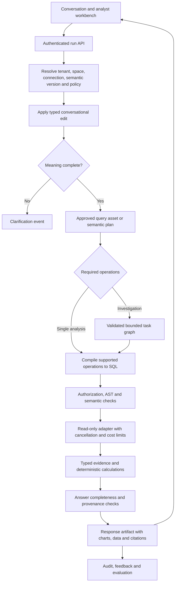

# TachyonIQ: target design and completion contract

Review date: 12 September 2026. Status: proposed redesign, not an implemented release.

## 1. Product decision

Build a governed conversational analytics platform that preserves business meaning across questions, executes reproducible analysis, and explains every material conclusion with evidence. Target business analysts and business users working across enterprise data platforms. Keep development local until deployment is justified.

An advanced product must outperform on measured correctness, conversational continuity, governance, and time to a useful decision. More agents, connectors, charts, or longer context windows do not establish superiority. Start with one curated sales domain and certify integrations incrementally.

Scope of this review: current working-tree source, existing design documents, the original enterprise brief, prior live demo responses, and current official vendor documentation. This is not an exhaustive penetration test or a fresh live-provider benchmark. Earlier passing unit tests are not evidence of enterprise readiness. Existing uncommitted changes were preserved; this review does not certify them.

## 2. What the reference products establish

| Reference | Documented pattern to adopt | TachyonIQ design implication |
| --- | --- | --- |
| Databricks Genie Agents, formerly Genie Spaces | Domain-specific agents curated with Unity Catalog datasets, business semantics, examples and instructions | Make an analytics space a governed, versioned product, not just a connection picker. [Official overview](https://docs.databricks.com/aws/en/genie-agents/) |
| Genie evaluation and feedback | SQL result comparison for chat benchmarks, separate agent evaluation, reviewed corrections; benchmarks start new conversations | Evaluate numeric results and conversation sequences independently; promote corrections through a review process. [Test and monitor](https://docs.databricks.com/aws/en/genie-agents/monitor) |
| Snowflake verified query repository | Relevant verified question/SQL pairs ground subsequent answers, with verifier metadata and identification of the asset used | Add reviewed query assets with semantic-version compatibility and executable fixtures. Similarity alone must never certify an answer. [Verified query repository](https://docs.snowflake.com/en/user-guide/views-semantic/verified-query-repository) |
| Cortex Agents | Governed orchestration combines Cortex Analyst semantic SQL, Cortex Search, tools, persistent threads, monitoring and evaluations | Compare the full TachyonIQ experience with the Analyst-plus-Agents stack. Keep structured analytics and document retrieval as distinct tools under one policy boundary. [Cortex Agents](https://docs.snowflake.com/en/user-guide/snowflake-cortex/cortex-agents) |

These are documented capabilities, not independent accuracy measurements or claims of universal regional availability. The older local Genie gap analysis contains unsupported statements about vendor models, retrieval internals, and TachyonIQ production quality. It must not be used as a competitive fact sheet.

Proposed differentiation: portable governed semantics across certified databases; transparent numeric evidence and reproducible calculations; strong multi-turn editing; customer-controlled deployment and provider choice. These are hypotheses to validate with customers and matched benchmarks, not advantages already achieved. Cross-platform access is not automatically cross-database federation.

## 3. Findings that block the goal

| Priority | Evidence in this implementation | Required outcome |
| --- | --- | --- |
| P0 | `api/app.py` builds one SCL, retriever, validator and conversation store. `api/routes/query.py` changes only the execution adapter for a selected connection. | Resolve a matching connection, semantic version, dialect, policy and retrieval namespace atomically for each request. Reject incompatible combinations. |
| P0 | The last live follow-up comparison returned one current-month COUNT with no baseline, yet had `error=null`. The word-count bypass in `pipeline/orchestrator.py` only avoided investigation. | Comparison completion requires both periods, compatible populations and units, and explicit date boundaries. Ambiguous periods require clarification or a visible configured default. |
| P0 | `result_analyser.py` sums numeric result columns and uses those sums as findings. Demo status-level distinct customer counts total 827 while the global distinct count is 344. | Non-additive metrics cannot be rolled up by summing group results. Compute the global distinct independently or omit the total. Explain overlapping membership. |
| P0 | The recently added `users` aliases point to customers who ordered, although the database has 400 customer accounts and 344 purchasing customers. | Separate account count from purchasing-customer count. Do not treat people, companies and purchasers as interchangeable terms. Clarify or use explicitly approved business definitions. |
| P0 | Investigation receives table names and column counts rather than usable column/metric context. Its evidence summary contains row counts and column names, not numeric findings. | Supply authorized typed schema and approved aggregate evidence. A model cannot substantiate a numeric conclusion from row counts alone. |
| P0 | In `investigation_agent.py`, no dependency-ready task leads to OBSERVE_RESULT; remaining blocked tasks send execution back to ACT. This can loop until the step budget. | Validate task identifiers and dependency DAGs, detect failed dependencies/no progress, terminate explicitly, and test exact failure paths. This is a demonstrated code risk, not a confirmed trace of the screenshot's particular task graph. |
| P0 | Investigation failures can be serialized as ordinary answers with no structured error; successful completion uses ESCALATE as a sentinel. | Separate completed, needs_clarification, no_data, partial, failed, cancelled and budget_exceeded outcomes. Never label an unverified synthesis successful. |
| P0 | Connection ownership checks exist, but schema refresh profiles all reflected tables; semantic exclusions are not applied there. UI interpolates question, answer and other strings into HTML. | Apply database and application authorization to metadata and profiles as well as queries; replace unsafe rendering and test injection. |
| P1 | POST and SSE duplicate the pipeline. Investigation schema is mutable on a shared agent. | One run engine emits typed events; all request context is immutable/request-scoped. Test simultaneous requests from different spaces. |
| P1 | Schema selection now invokes full profiling; UI references a relationship count that refresh does not return. SQL/Data panels retain global last-result state. | Cheap authorized schema reads; explicit background profiling; response-bound inspectors; clear stale/error/empty states. |
| P1 | `run_accuracy_eval.py` has six seed cases and checks SQL substrings. Default tests exclude evaluation and live LLM checks. Integration fixtures have polluted the demo registry. | Isolated fixtures, meaningful golden-result and multi-turn suites, provider evaluation artifacts and reproducible test data. |
| P1 | Critic scores heuristic result properties; e.g. statistical sample size is inferred from output row count. Replanner changes plan structure to improve scores. | Evaluate semantics and statistical prerequisites explicitly. Two aggregated rows may represent millions of observations. Repairs must preserve the requested meaning. |

Retain the useful foundations: Python/FastAPI, Pydantic contracts, SCL parsing, hybrid retrieval abstraction, SQLGlot validation before every execution, adapter interface, deterministic analytics modules, tracing and existing tests. Refactor around stronger contracts instead of discarding everything.

## 4. Target architecture

Use a modular monolith with a separate worker process for expensive work. Locally: Python API, component-based TypeScript UI, local PostgreSQL for durable application state, existing local vector storage behind an interface, and a filesystem artifact store. Introduce Redis only when shared queues/cache or multiple workers justify it. No Kubernetes or service-per-agent design is required.

Database privileges remain authoritative. SQL validation is defense in depth, not a substitute for database authorization. Every tool, including document retrieval and future federation, must use the same identity and policy context.

Core objects:

| Object | Mandatory content |
| --- | --- |
| AnalyticsSpace | Tenant, owners, certified connection bindings, published semantic version, policy, allowed tools, benchmark set |
| SemanticSnapshot | Entities and grains, qualified columns, governed joins, metrics, time/currency rules, synonyms, schema fingerprint |
| ConversationState | Space and connection binding, typed active plan, selected entities, time context, parent response, pending clarification, version |
| AnalysisPlan | Metrics, dimensions, filters, both comparison windows, join grain, operation types, expected result contract |
| Run | Identity, plan/version hashes, idempotency key, deadlines, actual usage, event sequence, cancellation and terminal status |
| EvidenceArtifact | Authorized result reference, numeric aggregates, SQL/query ID, parameters, snapshot/time, units, transformations, policy label |
| ResponseArtifact | Status, answer claims linked to evidence, chart/table references, assumptions, incomplete coverage, lineage |
| VerifiedQuery | Reviewed question/parameter template, semantic version, expected results, author/reviewer and regression history |

Metadata and cache keys include tenant, space, connection, semantic version and effective policy. Permission changes invalidate access even to previously saved artifacts. Model/prompt/compiler versions and data freshness are captured for reproducibility; exact data replay requires a retained authorized snapshot or database time-travel support.

## 5. Analytical and conversational redesign

### Semantic compiler

Extend metrics with entity grain, additive/non-additive behavior, distinct entity key, allowed rollups, numerator/denominator for ratios, units, mandatory filters, time dimension, fiscal calendar, timezone and currency policy. Guard against join fanout before execution. Recompute ratios from components; do not average averages or sum distinct counts.

Let the LLM propose an intent or typed plan. Compile supported aggregation, ranking, filtering, time-series and comparisons deterministically to dialect-specific SQL. Keep constrained SQL generation for advanced supported cases, checked against plan invariants as well as security. Parameterize values; resolve identifiers through the semantic catalog.

### Conversation compiler

Represent follow-ups as edits: add/remove filter, change grouping, compare periods, choose entity, change visualization, reset analysis. Preserve the last successful typed plan. A failed run does not overwrite it. Do not infer analytical complexity from word count.

For the actual demo sequence:

1. Count customers who ordered: return 344 from distinct order customer IDs.
2. Group by status: show five groups and explicitly state that customers can occur in multiple groups. Do not headline 827 as unique customers.
3. Compare to last period: there is no prior time window in that analysis. Ask which periods to compare, or apply a space-level default with exact displayed dates.
4. Once resolved, preserve status grouping and customer definition; return current and baseline values and deterministic differences. Handle zero baselines and missing periods separately.

Comparison windows must specify complete-period versus period-to-date alignment and data freshness. Freeze the evaluation clock; the demo data ends on 5 September 2026, so wall-clock-relative queries can otherwise change independently of code.

### Evidence and investigation

Route by plan operations, adapter capabilities and predicted resource needs. Investigations use a validated acyclic task graph, authorized aggregate tools, deterministic statistics and claim checks. Reserve resources for synthesis and verification. Track tokens/tool attempts/time from actual calls; enforce cancellation and no-progress detection.

Carry aggregate values and computation provenance in a typed evidence envelope. A policy determines which aggregates can reach the model; suppress sensitive small groups where required. Keep raw identifiers out of external prompts by default. Document-based explanations must cite source passages and remain distinct from numeric evidence.

Do not infer causation from a regional revenue breakdown. Report contribution analysis as contribution; reserve causal language for supported designs. Significance needs observation counts, assumptions and an appropriate test. Forecasts need held-out backtests, seasonality checks and intervals.

## 6. Product experience and governance

Business experience: select an approved analytics space, see its purpose/freshness and sample questions, ask a question, resolve ambiguity inline, inspect an answer card, and edit the analysis conversationally. Each card owns its chart, data, SQL and evidence. Show plain-language progress, cancel/retry controls, comparison dates and explicit no-data/partial states. Separate data-health checks from answer correctness; a 100% null/duplicate score is not an accuracy guarantee.

Analyst workbench: schema and join explorer, metric editor, semantic review/publish/rollback, verified-query editor, correction inbox and evaluation comparison. Corrections produce reviewable candidates rather than silently teaching the production agent.

Platform administration: tenant/space roles, OIDC identity, required issuer/audience/expiry validation, managed secret references and rotation, connector certification, audit retention, quotas and access revocation. Use provider-native user delegation where practical; otherwise document and test the policy obligations of service identities. Shared files and documents need the same authorization discipline.

Connector sequence: SQLite for deterministic fixtures; PostgreSQL as the first production reference; then Snowflake and Databricks; then SQL Server/Synapse, BigQuery, MySQL and Redshift according to customers. A generic SQLAlchemy fallback is not certification. Each connector needs real authentication, permissions, schema/precision/timezone handling, pagination, cancellation, query IDs, cost controls and failure tests.

Start multi-source support with explicit source selection. Federation is a later opt-in capability requiring compatible entity mappings, currencies/grains, permission checks on every source, bounded movement and partial-failure semantics. For Snowflake/Databricks customers, consider optional native semantic/analyst backends through adapters rather than forcing duplication of existing governed assets.

## 7. Delivery backlog and exit gates

Estimates below are planning ranges, not commitments. Assumption: two backend/analytics engineers, one frontend engineer, one QA/platform engineer, and regular access to a domain analyst and provider test accounts. Re-estimate after the first milestone; work can overlap only after its dependencies are stable.

| Milestone | Work and main files/modules | Exit gate | Indicative duration |
| --- | --- | --- | --- |
| M0: truthful baseline | Regression fixtures; isolate test registries; fix misleading outcomes, distinct totals, unsafe rendering, ambiguous comparisons and aliases. Current orchestrator/analyser/UI/evaluation files. | Screenshot sequence returns correct data or clarification; no false-success comparison; tests leave demo untouched. | 1–2 weeks |
| M1: analytical core | SemanticSnapshot, typed conversation edits, compiler, immutable request scope and result invariants. Refactor SCL, query planner, conversation store and orchestrator. | Tenant/connection isolation and deterministic core operations; published semantic versions bound to runs. | 3–5 weeks |
| M2: customer pilot | New UI, durable runs/events, cheap schema endpoint, PostgreSQL certification, identity/secrets, verified queries and review workflow. | Business users complete benchmarked conversations; permission/restart/cancel paths demonstrated. | 3–5 weeks |
| M3: advanced analysis | Repair investigation lifecycle/DAG, numeric evidence, deterministic contribution/significance/forecast tools; certify first warehouse connectors. | Bounded investigations produce supported claims; budgets and concurrent requests verified. | 4–6 weeks |
| M4: differentiation | Additional connectors, governed document evidence, optional native backends, approved federation, deployment hardening and competitive study. | Matched customer benchmark and production readiness review. | 4–8+ weeks |

A credible controlled pilot is approximately 7–12 weeks with the assumed team and parallelism. A broader advanced release is approximately 4–6+ months. Access delays, schema complexity and narrower staffing extend these ranges. Local implementation can proceed immediately; production connector certification requires actual provider environments.

Implement by replacing internals behind existing routes with one event-producing run engine. Adapt POST to consume the terminal event and SSE to stream the same events. Maintain backward-compatible response fields during migration. Shadow-evaluate new plans against fixtures before enabling them; never shadow-run against unauthorized production sources. Keep feature flags and rollback per semantic/runtime version. Do not run the old and new pipelines as competing sources of truth.

## 8. Definition of completion

Proposed release gates; these are targets, not measured achievements:

| Gate | Required evidence |
| --- | --- |
| Correctness | At least 200 held-out questions across three representative domains; >=95% result correctness on supported single-turn queries; 100% on critical business metrics and the deterministic regression suite. |
| Conversation | At least 50 sequences of 5–10 turns, including corrections/resets/connection changes; >=90% sequence success. Grade clarification separately and penalize confident wrong answers. |
| Semantic invariants | Every completed comparison has both validated windows; every reported total respects metric additivity; every material numeric claim has evidence. |
| Security | Zero known authorization escapes across the required adversarial suite covering queries, metadata, exports, caches, conversations and concurrent tenants. Passing is not proof of universal security. |
| Reliability | Restart/resume, idempotent submission, cancellation, bounded retries, dependency failures, schema drift and provider outage tests pass. |
| Performance | Initial progress within 1 second; target p95 <=15 seconds for simple analysis and <=60 seconds for bounded investigations on a specified fixture/hardware/concurrency profile. Report provider and database time separately. |
| Cost | Measured per-run model and database usage; enforce space budgets and report cost per correct answer. Set currency ceilings after the first measured benchmark. |
| Connector readiness | Each advertised certified connector passes tests against its real service/version with permission and cancellation evidence. |
| Pilot acceptance | Domain analysts approve definitions and representative outputs; business users finish a predefined task set without developer intervention. |

Use golden result sets with numeric tolerances, order-insensitive comparisons where appropriate, expected units/populations, date boundaries, and required evidence. Include zero results, overlapping distinct groups, many-to-many joins, currency changes, missing baselines, DST/fiscal boundaries, ambiguous entities and adversarial metadata. Empty data can be a correct answer and must not cause silent filter removal.

For competitive claims, test the same supported business tasks on equivalent governed data, comparable semantic setup effort and identical time assumptions. Repeat stochastic runs, keep a held-out set, report uncertainty and failures, and grade correctness, task completion, latency, cost and onboarding effort. Without access to competitor environments, report documentation-based design alignment only. “More advanced” is complete only when these measurements substantiate the claimed advantages.

## 9. Immediate implementation decision

Start with M0 and the typed contracts for M1. Prioritize the comparison contract, metric additivity and request-scoped semantics before more autonomous reasoning. Preserve the existing validator and execution boundary while changing the architecture around them. Treat current demos as development evidence, not release acceptance.

## 10. Implementation checkpoint — 2026-09-12

The first M0 implementation slice is complete in the working tree:

- Metric definitions now carry additivity into the query plan. Grouped distinct-customer
  results no longer produce a false rolled-up total, while a single global value remains
  reportable.
- Customer accounts and customers who placed an order are separate demo metrics. The term
  `users` is no longer an approved alias for either population.
- A time comparison without both a primary and baseline period ends with a clarification.
  Follow-up routing uses intent semantics rather than question length.
- Investigation plans reject duplicate IDs, unknown dependencies, self-dependencies and
  cycles before execution. Blocked plans terminate, completed evidence can reach synthesis
  at the step boundary, and incomplete investigations return a structured error.
- Schema refresh now returns relationship counts used by the UI. Dynamic UI content is HTML
  escaped, and suggested-question buttons no longer embed inline user-derived JavaScript.
- Integration tests use isolated connection registries, so running the suite does not add
  connections to the local demo registry.

Automated verification: 546 tests pass; Python compilation, critical undefined-name checks,
JavaScript syntax validation and whitespace checks pass. The local demo registry retained its
single `demo` connection across the suite. The M0 manual acceptance sequence remains to be run
after restarting the local server.

The next implementation slice is M1's immutable request scope: bind the selected connection,
schema fingerprint, published semantic version, SQL dialect, authorization policy and retrieval
namespace into one `AnalyticsSpaceSnapshot`. Planning, validation, execution, conversation state,
cache keys and audit events must all consume that same snapshot. This removes the largest
remaining architecture risk before adding more autonomous analysis.
